# Architecture

This repository is a production-ready OpenTofu/Terraform framework for deploying a STACKIT Landing Zone. It provisions the complete cloud foundation, covering governance hierarchy, identity and access management, shared networking, optional firewall, DNS, secrets management, observability, and repeatable per-workload project templates.

Everything is composed from six modules under `src/modules/` and wired together in `src/main.tf`. A single `terraform apply` with one of the three reference configs in `src/config/` stands up the full platform.

## Two-Layer Model

```
Organization
├── Platform Landing Zone   ← managed by platform team, provisioned once
│   ├── Management project  (automation, state, secrets, observability)
│   ├── Connectivity project (network hub, firewall, DNS)
│   └── DevOps project      (optional managed Git)
└── Application Landing Zones  ← one per workload/environment
    ├── Corporate LZ        (attached to shared network, routed via firewall)
    └── Public LZ           (standalone network, internet-facing)
```

**Platform Landing Zone** is the company-wide foundation. It is deployed once and owned by the platform team. It establishes the governance structure, shared network infrastructure, and automation tooling that all workloads build on.

**Application Landing Zone** is instantiated once per workload and environment (e.g. `data-prod`, `api-staging`). Each instance is an isolated STACKIT project with pre-wired networking, RBAC, secrets, and storage: ready for a team to deploy into without any platform decisions left to make.

## Modules

All modules live under `src/modules/`. The root `src/main.tf` calls them in dependency order.

| Module | Folder in repo | What it builds |
|---|---|---|
| `governance` | `src/modules/governance/` | Resource manager folder hierarchy, org-level RBAC, custom roles |
| `management` | `src/modules/management/` | Automation project: service account, Terraform state bucket, Secrets Manager, Observability |
| `connectivity` | `src/modules/connectivity/` | Network hub: Network Area, WAN routing table, optional firewall VM, DNS zones |
| `devops` | `src/modules/devops/` | Optional DevOps project with managed Git instance |
| `landing-zone` | `src/modules/landing-zone/` | Per-workload project: network, RBAC, Secrets Manager, object storage, DNS child zone, routing |
| `sandboxes` | `src/modules/sandboxes/` | Lightweight sandbox projects for experimentation |

### Governance

Builds the resource manager folder hierarchy under the root organization. Default folders:

- **Platform**: parent for all platform projects (management, connectivity, devops)
- **Landing Zones - Corporate**: parent for network-connected workload projects
- **Landing Zones - Public**: parent for internet-facing workload projects
- **Sandboxes**: parent for ephemeral sandbox projects

Also manages organization-level role assignments for owners (`organization_owners`) and read-only auditors (`organization_auditors`).

Source: `src/modules/governance/`

### Management

Provisions the central automation project (`<company_code>-pltfm-mgmt-prod`). Contains:

- **Service account**: used by CI/CD pipelines to run Terraform. Supports OIDC federation (e.g. GitHub Actions) so pipelines authenticate without long-lived keys.
- **Object storage buckets**: one for Terraform remote state, one for general platform use.
- **Secrets Manager instance**: stores platform secrets such as service account keys and credentials.
- **Observability instance** (optional): centralized logs, metrics, and traces with configurable retention. Enabled via the `observability` variable.

Source: `src/modules/management/`

### Connectivity

Builds the network hub project (`<company_code>-pltfm-hub-prod`) that all corporate landing zones attach to. This is the most complex module.

#### Network Area

A STACKIT Network Area defines a shared private IP address space at the organization level. All corporate landing zone networks are created inside this area and can reach each other over private IPs without any additional peering.

Configuration drives the area's address plan:

```hcl
network_area = {
  ranges                = ["10.0.0.0/16"]   # total address space
  transfer_network      = "10.255.0.0/24"   # internal STACKIT routing fabric
  min_prefix_length     = 24                # smallest subnet a landing zone may request
  max_prefix_length     = 28                # largest subnet a landing zone may request
  default_prefix_length = 25               # default if landing zone doesn't specify
}
```

#### WAN Routing Table

A routing table named `wan` is created with a single default route:

```
0.0.0.0/0 → internet
```

This is the route for outgoing traffic used by the firewall´s wan network. Traffic exits directly to the internet via STACKIT's default gateway.

#### DNS Zones

One or more DNS zones are created in the connectivity project and serve as the authoritative zones for the platform. Child zones are delegated to individual landing zones automatically. Subdomains are not allowed with domains provided by STACKIT like .stackit.run.

Example: if the hub zone is `example-corp.stackit.run.`, a landing zone for the `data` workload in `prod` in region `eu01` gets a delegated child zone `data-prod-eu01-example-corp.stackit.run.`.

#### Firewall VM (optional)

When `connectivity.firewall` is set, a VM running OPNsense (provided as a `.qcow2` image) is deployed with two network interfaces:

| Interface | STACKIT network | Purpose |
|---|---|---|
| `vtnet0` (WAN) | `wan_network`: attached to the WAN routing table | Outbound internet egress, assigned a static public IP |
| `vtnet1` (LAN) | `lan_network`: a dedicated private subnet | Internal next-hop for all corporate landing zone traffic |

The firewall's LAN IP is exported as `firewall_next_hop_ip` and passed to every corporate landing zone so they can point their default route at it.

Source: `src/modules/connectivity/`

### Landing Zone

Instantiated once per workload/environment via `for_each` over the `landing_zones` variable. Each instance creates a fully isolated STACKIT project containing:

- **STACKIT project**: placed under the corporate or public folder depending on the `corporate` flag.
- **Network**: corporate landing zones get a routed network attached to the shared Network Area; public landing zones get a standalone network.
- **Routing table** (corporate + firewall only): a per-project routing table with a single default route pointing to the firewall LAN IP:
  ```
  0.0.0.0/0 → <firewall_lan_ip>
  ```
  Without a firewall, corporate landing zones use east-west routing through the Network Area but egress directly to the internet via the WAN routing table.
- **RBAC**: role assignments for the application team, defined per landing zone in the `role_assignments` list.
- **Secrets Manager**: isolated instance for workload secrets.
- **Object storage buckets**: one for application data, one for Terraform state.
- **DNS child zone**: delegated from the connectivity hub zone (hub-spoke and firewall flavors only).
- **Service account**: workload-scoped service account with a rotating key stored in Secrets Manager.

The `corporate` flag is the key switch:

| `corporate` | Network attachment | Default route | DNS |
|---|---|---|---|
| `true` | Shared Network Area | Firewall LAN IP (if firewall deployed), else internet via WAN table | Child zone delegated from hub |
| `false` | Standalone network | Internet directly | No DNS delegation |

Source: `src/modules/landing-zone/`

### DevOps (optional)

Provisions a separate DevOps project (`<company_code>-pltfm-devops-prod`) with a managed Git instance (Gitea or equivalent, controlled by `git_flavor`). Network access can be restricted to specific CIDR ranges via `allowed_network_ranges`. Disabled by default: enable by setting the `devops` variable.

Source: `src/modules/devops/`

### Sandboxes (optional)

Provisions one or more lightweight STACKIT projects under the Sandboxes folder for experimentation and PoCs. Each sandbox is a minimal project with an owner: no shared networking or platform integration. Useful for testing before promoting workloads to a proper landing zone.

Source: `src/modules/sandboxes/`

## Deployment Flavors

Three reference configurations are provided in `src/config/`. Select the one that matches your network requirements.

### Standalone

The simplest configuration. Provisions governance, management, and one or more landing zone projects. No shared network infrastructure — each landing zone uses an independent network suitable for internet-facing or isolated workloads.



**Use when:** workloads do not require private connectivity to each other or to on-premises systems.

### Hub-Spoke

Adds a connectivity hub with a shared Network Area. All corporate landing zones are attached to this area, enabling private east-west traffic between projects and a shared IP address plan. DNS zones are managed centrally in the hub project.



**Use when:** workloads need private connectivity to each other and a shared DNS namespace, but centralized traffic inspection is not required.

### Hub-Spoke + Firewall

Extends the hub-spoke topology with a firewall VM deployed in the connectivity project. All corporate landing zones route their default traffic through the firewall LAN interface, enabling centralized egress inspection and east-west traffic control.



**Use when:** compliance requirements mandate traffic inspection, or centralized egress control with a consistent public IP is needed.

## Network Topology

The three deployment flavors differ only in what the connectivity module deploys and how landing zone traffic is routed.

### Standalone

No connectivity module. Each landing zone has an independent network with direct internet access. No shared IP space, no private east-west connectivity, no DNS federation.

```
[LZ Project A]──internet
[LZ Project B]──internet
```

### Hub-Spoke

Connectivity module deploys a Network Area and WAN routing table. All corporate landing zones join the Network Area and can reach each other over private IPs. Default route is the WAN routing table (internet egress, no inspection).

```
[LZ Corporate A] ──┐
[LZ Corporate B] ──┤── Network Area (10.0.0.0/16) ──── internet (WAN table)
[LZ Corporate C] ──┘
[LZ Public D]   ──── standalone ──── internet
```

### Hub-Spoke + Firewall

Extends hub-spoke: a firewall VM sits in the connectivity project. Each corporate landing zone routes all traffic (`0.0.0.0/0`) through the firewall LAN IP. The firewall's WAN interface holds a static public IP for consistent egress identity.

```
[LZ Corporate A] ──┐  routing: 0.0.0.0/0 → 10.0.0.4 (firewall LAN)
[LZ Corporate B] ──┤── Network Area (10.0.0.0/16) ──→ [Firewall VM]
[LZ Corporate C] ──┘                                    vtnet1 (LAN) 10.0.0.4
                                                         vtnet0 (WAN) ──→ internet
                                                                         (static public IP)
[LZ Public D]   ──── standalone ──── internet
```

Traffic flow for a corporate landing zone (firewall flavor):

1. VM in LZ sends packet to any destination.
2. Routing table entry `0.0.0.0/0 → 10.0.0.4` forwards it to the firewall LAN interface (`vtnet1`).
3. Firewall inspects and NATs the packet out through `vtnet0` (WAN) using the static public IP.
4. Return traffic arrives at the public IP, firewall translates back and delivers to the originating VM.

East-west traffic between corporate LZs stays within the Network Area and can be permitted or denied by firewall policies.

## Resource Naming

All resources follow a consistent convention driven by `company_code`:

```
<company_code>-<layer>-<component>-<env>
```

| Example name | What it is |
|---|---|
| `exc-pltfm-mgmt-prod` | Management project |
| `exc-pltfm-hub-prod` | Connectivity (hub) project |
| `exc-pltfm-devops-prod` | DevOps project |
| `exc-lz-data-prod` | Application landing zone for workload `data` in `prod` |
| `exc-sbx-*` | Sandbox projects |

`exc` is the `company_code` from the example config. Replace with your organization's short code.
