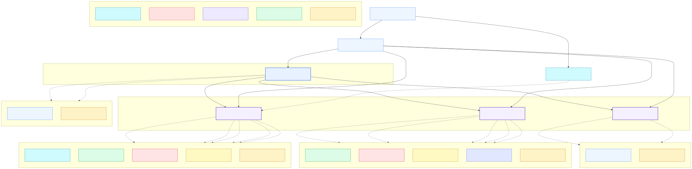
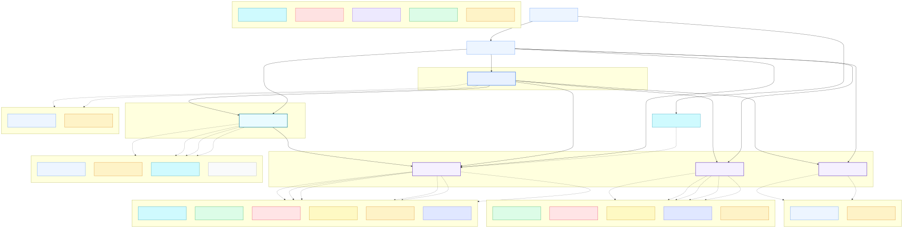
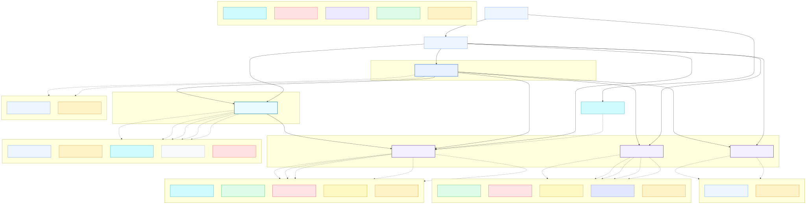

# Architecture

This repository is a production-ready OpenTofu/Terraform framework for deploying a STACKIT Landing Zone. It provisions the complete cloud foundation, covering governance hierarchy, identity and access management, shared networking, optional firewall, DNS, secrets management, observability, and repeatable per-workload project templates.

Everything is composed from six modules under `src/modules/` and wired together in `src/main.tf`. A single `terraform apply` with one of the complete reference configurations in `src/config/` stands up the full platform.

## Two-Layer Model

```
Organization
├── Platform Landing Zone   ← managed by platform team, provisioned once
│   ├── Management project  (automation, state, secrets, observability)
│   ├── Connectivity project (network hub, firewall, DNS)
│   └── DevOps project      (optional managed Git)
└── Application Landing Zones  ← one per workload/environment
    ├── Corporate LZ        (attached to shared network, routed via firewall)
    └── Public LZ           (standalone network, internet-facing)
```

**Platform Landing Zone** is the company-wide foundation. It is deployed once and owned by the platform team. It establishes the governance structure, shared network infrastructure, and automation tooling that all workloads build on.

**Application Landing Zone** is instantiated once per workload and environment (e.g. `data-prod`, `api-staging`). Each instance is an isolated STACKIT project with pre-wired networking, RBAC, secrets, and storage: ready for a team to deploy into without any platform decisions left to make.

## Modules

All modules live under `src/modules/`. The root `src/main.tf` calls them in dependency order.

| Module | Folder in repo | What it builds |
|---|---|---|
| `governance` | `src/modules/governance/` | Resource manager folder hierarchy, org-level RBAC, custom roles |
| `management` | `src/modules/management/` | Automation project: service account, Terraform state bucket, Secrets Manager, Observability |
| `connectivity` | `src/modules/connectivity/` | Network hub: Network Area, WAN routing table, optional firewall VM, DNS zones |
| `devops` | `src/modules/devops/` | Optional DevOps project with managed Git instance |
| `landing-zone` | `src/modules/landing-zone/` | Per-workload project: network, RBAC, Secrets Manager, object storage, DNS child zone, routing |
| `sandboxes` | `src/modules/sandboxes/` | Lightweight sandbox projects for experimentation |
| `firewall-config` | `src/modules/firewall-config/` | Optional: rules, NAT and internet hardening pushed to the OPNsense appliance through its API |

### Governance

Builds the resource manager folder hierarchy under the root organization. Default folders:

- **Platform**: parent for all platform projects (management, connectivity, devops)
- **Landing Zones - Corporate**: parent for network-connected workload projects
- **Landing Zones - Public**: parent for internet-facing workload projects
- **Sandboxes**: parent for ephemeral sandbox projects

Also manages organization-level role assignments for owners (`organization_owners`) and read-only auditors (`organization_auditors`).

Source: `src/modules/governance/`

### Management

Provisions the central automation project (`<company_code>-pltfm-mgmt-prod`). Contains:

- **Service account**: used by CI/CD pipelines to run Terraform. Supports OIDC federation (e.g. GitHub Actions) so pipelines authenticate without long-lived keys.
- **Object storage buckets**: one for Terraform remote state, one for general platform use.
- **Secrets Manager instance**: stores platform secrets such as service account keys and credentials.
- **Observability instance** (optional): centralized logs, metrics, and traces with configurable retention. Enabled via the `observability` variable.

Source: `src/modules/management/`

### Connectivity

Builds one network hub project per configured connectivity domain. Each corporate landing zone attaches explicitly to one domain. This is the most complex module.

#### Network Area

A STACKIT Network Area (SNA) defines a shared private IP address space at the organization level. Corporate landing zone networks created in the same SNA can reach each other over private IPs without additional peering.

Configuration drives the area's address plan:

```hcl
network_area = {
  ranges                = ["10.0.0.0/16"]   # total address space
  transfer_network      = "10.255.0.0/24"   # internal STACKIT routing fabric
  min_prefix_length     = 24                # smallest subnet a landing zone may request
  max_prefix_length     = 28                # largest subnet a landing zone may request
  default_prefix_length = 25               # default if landing zone doesn't specify
}
```

#### Multiple Network Areas

`connectivity.network_areas` creates multiple independent connectivity domains. It is a map keyed by stable, meaningful identifiers; keys may represent any business, security, tenant, connectivity, or regional boundary, such as `regulated`, `tenant_a`, `private_connectivity`, `eu01`, or `eu02`. They are not restricted to development and production environments.

Each key creates its own SNA, connectivity project, WAN routing table, and DNS defaults. Corporate landing zones select their domain with `network_area_key`; DNS zones use `dns_zones.<zone>.network_area_key`. Platform Kubernetes uses `platform_kubernetes.<key>.network.network_area_key`. Connectivity projects are labeled with the SNA ID and the corresponding key, and the `*_by_area` outputs use the same keys.

For example, regulated workloads can use a dedicated `regulated` SNA while shared workloads use `shared`. The same model also separates tenants, business units, or connectivity zones. See [the complete multi-area configuration](../src/config/hub-and-spoke-multi-area.tfvars). [Getting Started](getting-started.md#deployment-flavours) describes all available scenarios.

The legacy `connectivity.network_area` input remains supported for single-area deployments and maps to the `default` key. Existing scalar connectivity outputs continue to reference that legacy default area.

#### Multi-Region Deployments

The root module has one STACKIT provider default region, so every SNA in one execution is created in that region. For an active topology with one SNA per region, such as `eu01` and `eu02` connected through VPN, deploy one root stack per region and exchange VPN tunnel endpoints through the outputs. A future single-stack multi-region implementation requires statically declared STACKIT provider aliases because Terraform cannot select provider aliases dynamically from `network_areas`.

#### WAN Routing Table

A routing table named `wan` is created with a single default route:

```
0.0.0.0/0 → internet
```

This is the route for outgoing traffic used by the firewall´s wan network. Traffic exits directly to the internet via STACKIT's default gateway.

#### DNS Zones

One or more DNS zones are created in the connectivity project and serve as the authoritative zones for the platform. Child zones are delegated to individual landing zones automatically. Subdomains are not allowed with domains provided by STACKIT like .stackit.run.

Example: if the hub zone is `example-corp.stackit.run.`, a landing zone for the `data` workload in `prod` in region `eu01` gets a delegated child zone `data-prod-eu01-example-corp.stackit.run.`.

#### Firewall VM (optional)

When `connectivity.firewall` is set, a VM running OPNsense (provided as a `.qcow2` image) is deployed with two network interfaces:

| Interface | STACKIT network | Purpose |
|---|---|---|
| `vtnet0` (WAN) | `wan_network`: attached to the WAN routing table | Outbound internet egress, assigned a static public IP |
| `vtnet1` (LAN) | `lan_network`: a dedicated private subnet | Internal next-hop for all corporate landing zone traffic |

The firewall's LAN IP is exported as `firewall_next_hop_ip` and passed to every corporate landing zone so they can point their default route at it. Everything the platform sends outwards therefore crosses the appliance.

Both interfaces are DHCP clients and pick up the fixed addresses STACKIT assigns them. The image boots with almost no policy: only the two default `allow LAN to any` rules (IPv4 and IPv6), no gateways, no static routes, no IPsec, and outbound NAT on `automatic`. It filters nothing until a policy is pushed.

> [!WARNING]
> After the first apply the web GUI answers on the public IP to the whole internet, and it still carries the `root` password shipped in the image, which is identical on every copy. Port 443 is open, 80 and 22 are not, and there is no security group in front of the WAN interface. Pushing the policy closes it, so do not leave a deployment sitting between the two applies — see [Configure OPNsense firewall](getting-started.md#configure-opnsense-firewall). Binding the GUI to the LAN interface only (**System → Settings → Administration → Listen Interfaces**) is the alternative that does not depend on the ruleset.

#### High availability (optional)

A single appliance is a single point of failure for every corporate landing zone: it is their default route. Setting `connectivity.firewall.ha` turns it into an active/passive CARP pair.

| | Primary | Backup |
|---|---|---|
| Availability zone | `firewall.zone` | `firewall.ha.backup_zone` (must differ) |
| LAN address | `.4` of `lan_network_range` | `.5` |
| WAN address | `.4` of `wan_network_range` | `.5` |
| Public IP | own, static | own, static |
| CARP advskew | 0 (wins the election) | 100 |

A CARP virtual IP on the LAN — `.6` of `lan_network_range` by default — replaces the primary's LAN address in the `firewall_next_hop_ip` output, so the landing zone routes point at the VIP instead of at a node. Failover moves the VIP to the surviving node in about a second and the routes never change.

**CARP runs in unicast mode** (OPNsense >= 24.7). Not a preference: the STACKIT fabric delivers traffic *to* the CARP virtual MAC but drops advertisements sourced *from* it, so multicast CARP ends in a split brain. The module refuses to configure a node whose OPNsense has no unicast `peer` field.

Two things are pushed outside the OPNsense provider, because it only ever talks to the primary:

- `modules/connectivity/scripts/configure-ha.sh` writes the node-local half into each appliance during apply: the CARP VIP, `advskew`, the pfsync peer, and the XMLRPC sync target. These are exactly the settings the config sync does not replicate. It authenticates with the appliance login, so it works on the backup, which has no API key and never needs one.
- `modules/firewall-config/scripts/sync-ha-peer.sh` replicates the policy to the backup after every change. OPNsense's XMLRPC sync only fires on GUI saves, never on API writes, so without this the backup runs an empty ruleset and black-holes traffic the moment it becomes CARP master.

The `fw_cluster` alias and the `allow-fw-carp` / `allow-fw-pfsync` rules that let the two nodes talk are injected into `firewall_config` automatically when HA is on, sequenced at 90 and 91 — ahead of every rule the example policy ships. They are not in the `.tfvars` because a `block-lz-to-lz` rule placed above them silently kills the election and the state sync.

### Landing Zone

Instantiated once per workload/environment via `for_each` over the `landing_zones` variable. Each instance creates a fully isolated STACKIT project containing:

- **STACKIT project**: placed under the corporate or public folder depending on the `corporate` flag.
- **Network**: corporate landing zones get a routed network attached to the shared Network Area; public landing zones get a standalone network.
- **Routing table** (corporate + firewall only): a per-project routing table with a single default route pointing to the firewall LAN IP:
  ```
  0.0.0.0/0 → <firewall_lan_ip>
  ```
  Without a firewall, corporate landing zones use east-west routing through the Network Area but egress directly to the internet via the WAN routing table.
- **RBAC**: role assignments for the application team, defined per landing zone in the `role_assignments` list.
- **Secrets Manager**: isolated instance for workload secrets.
- **Object storage buckets**: one for application data, one for Terraform state.
- **DNS child zone**: delegated from the connectivity hub zone (hub-spoke and firewall flavors only).
- **Service account**: workload-scoped service account with a rotating key stored in Secrets Manager.

The `corporate` flag is the key switch:

| `corporate` | Network attachment | Default route | DNS |
|---|---|---|---|
| `true` | Shared Network Area | Firewall LAN IP (if firewall deployed), else internet via WAN table | Child zone delegated from hub |
| `false` | Standalone network | Internet directly | No DNS delegation |

Source: `src/modules/landing-zone/`

### DevOps (optional)

Provisions a separate DevOps project (`<company_code>-pltfm-devops-prod`) with a managed Git instance (Gitea or equivalent, controlled by `git_flavor`). Network access can be restricted to specific CIDR ranges via `allowed_network_ranges`. Disabled by default: enable by setting the `devops` variable.

Source: `src/modules/devops/`

### Sandboxes (optional)

Provisions one or more lightweight STACKIT projects under the Sandboxes folder for experimentation and PoCs. Each sandbox is a minimal project with an owner: no shared networking or platform integration. Useful for testing before promoting workloads to a proper landing zone.

Source: `src/modules/sandboxes/`

## Deployment Flavors

Complete reference configurations are provided in `src/config/`. Select the one that matches your network requirements; [Getting Started](getting-started.md#deployment-flavours) lists all available scenarios.

### Standalone

The simplest configuration. Provisions governance, management, and one or more landing zone projects. No shared network infrastructure — each landing zone uses an independent network suitable for internet-facing or isolated workloads.



**Use when:** workloads do not require private connectivity to each other or to on-premises systems.

### Hub-Spoke

Adds a connectivity hub with a shared Network Area. All corporate landing zones are attached to this area, enabling private east-west traffic between projects and a shared IP address plan. DNS zones are managed centrally in the hub project.



**Use when:** workloads need private connectivity to each other and a shared DNS namespace, but centralized traffic inspection is not required.

### Hub-Spoke + Firewall

Extends the hub-spoke topology with a firewall VM deployed in the connectivity project. All corporate landing zones route their default traffic through the firewall LAN interface, enabling centralized egress inspection and east-west traffic control.



**Use when:** compliance requirements mandate traffic inspection, or centralized egress control with a consistent public IP is needed.

## Network Topology

The three deployment flavors differ only in what the connectivity module deploys and how landing zone traffic is routed.

### Standalone

No connectivity module. Each landing zone has an independent network with direct internet access. No shared IP space, no private east-west connectivity, no DNS federation.

```
[LZ Project A]──internet
[LZ Project B]──internet
```

### Hub-Spoke

Connectivity module deploys a Network Area and WAN routing table. All corporate landing zones join the Network Area and can reach each other over private IPs. Default route is the WAN routing table (internet egress, no inspection).

```
[LZ Corporate A] ──┐
[LZ Corporate B] ──┤── Network Area (10.0.0.0/16) ──── internet (WAN table)
[LZ Corporate C] ──┘
[LZ Public D]   ──── standalone ──── internet
```

### Hub-Spoke + Firewall

Extends hub-spoke: a firewall VM sits in the connectivity project. Each corporate landing zone routes all traffic (`0.0.0.0/0`) through the firewall LAN IP. The firewall's WAN interface holds a static public IP for consistent egress identity.

```
[LZ Corporate A] ──┐  routing: 0.0.0.0/0 → 10.0.0.4 (firewall LAN)
[LZ Corporate B] ──┤── Network Area (10.0.0.0/16) ──→ [Firewall VM]
[LZ Corporate C] ──┘                                    vtnet1 (LAN) 10.0.0.4
                                                         vtnet0 (WAN) ──→ internet
                                                                         (static public IP)
[LZ Public D]   ──── standalone ──── internet
```

Traffic flow for a corporate landing zone (firewall flavor):

1. VM in LZ sends packet to any destination.
2. Routing table entry `0.0.0.0/0 → 10.0.0.4` forwards it to the firewall LAN interface (`vtnet1`).
3. Firewall inspects and NATs the packet out through `vtnet0` (WAN) using the static public IP.
4. Return traffic arrives at the public IP, firewall translates back and delivers to the originating VM.

East-west traffic between corporate LZs stays within the Network Area and can be permitted or denied by firewall policies.

## Site-to-Site VPN (optional)

Any hub-spoke flavor can terminate an IPsec VPN in the connectivity project, connecting the Network Area to on-premises or another cloud. Enable it with the `connectivity.vpn` block — see the commented example in `src/config/hub-and-spoke.tfvars`.

The gateway is highly available: it runs two tunnels in separate availability zones, each with its own public IP. Because both sides need the other's address, roll it out in two applies — provision the gateway with `connections = {}`, read `tofu output connectivity_vpn_public_ips`, configure the remote peer, then add the connection.

Pre-shared keys are kept out of the config object in the separate `vpn_pre_shared_keys` variable, so the tunnel topology stays committable:

```bash
export TF_VAR_vpn_pre_shared_keys='{"onprem"={"tunnel1"="<20+ chars>","tunnel2"="<20+ chars>"}}'
```

Routes to the remote prefixes are distributed through the Network Area automatically, so every corporate landing zone reaches the remote site without per-spoke configuration.

### What goes through the firewall

In the firewall flavor, two of the four traffic directions run through the appliance cleanly. Neither VPN direction can be filtered with the managed gateway: one breaks if you try, the other is not steerable at all.

| Direction | Through the firewall? | Mechanism |
|---|---|---|
| LZ → Internet | Yes, by default | Default route of the landing zone routing table points at the firewall LAN address. Needs an `outbound_nat` entry too, otherwise traffic reaches the appliance and stops there. |
| LZ → LZ | Yes, by default | `system_routes = false` suppresses project-to-project routes, so spoke-to-spoke falls to the default route. Needs a static route back into the Network Area, otherwise the traffic leaves through WAN and the egress NAT rewrites the source address. |
| LZ → on-premises (VPN) | **No** | The VPN prefix beats `0.0.0.0/0`, so it bypasses the appliance. |
| on-premises → LZ (VPN) | **No** | Delivered straight to the spoke through the STACKIT-managed routing table. Not steerable. |

Inbound VPN traffic bypasses the appliance because `static_routes` of a VPN connection are distributed as *dynamic* routes across the Network Area, and a remote prefix is always more specific than `0.0.0.0/0`. The VPN gateway itself forwards through a STACKIT-managed routing table that cannot be modified or reassigned.

> [!WARNING]
> Setting `dynamic_routes = false` does not fix the outbound direction, it breaks it. Outbound then goes through the firewall while inbound still bypasses it, and the stateful filter drops the half-flow it sees.

If VPN traffic has to be inspected, terminate the tunnel on the OPNsense appliance itself instead of using the managed gateway — it is already the default route for every corporate landing zone, so both directions stay symmetric. The trade-off is losing the managed gateway's active-active HA.


## Resource Naming

All resources follow a consistent convention driven by `company_code`:

```
<company_code>-<layer>-<component>-<env>
```

| Example name | What it is |
|---|---|
| `exc-pltfm-mgmt-prod` | Management project |
| `exc-pltfm-hub-prod` | Connectivity (hub) project |
| `exc-pltfm-devops-prod` | DevOps project |
| `exc-lz-data-prod` | Application landing zone for workload `data` in `prod` |
| `exc-sbx-*` | Sandbox projects |

`exc` is the `company_code` from the example config. Replace with your organization's short code.
