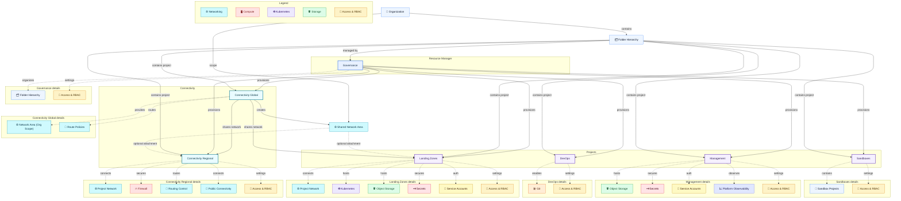

# Architecture Diagram: 02-hub-spoke

Generated from `examples/02-hub-spoke/main.tf`.

```mermaid
flowchart TB
  %% STACKIT architecture from 02-hub-spoke

  org["🏢 Organization"]
  folders["🗂️ Folder Hierarchy"]
  shared_network_area["🌐 Shared Network Area"]

  subgraph resource_manager["Resource Manager"]
    governance["Governance"]
  end

  subgraph connectivity["Connectivity"]
    connectivity_global["Connectivity Global"]
    connectivity_regional["Connectivity Regional"]
  end

  subgraph projects["Projects"]
    management["Management"]
    devops["DevOps"]
    sandboxes["Sandboxes"]
    landing_zone["Landing Zones"]
  end

  connectivity_global -->|shares network| connectivity_regional
  connectivity_global -->|shares network| landing_zone
  governance -->|provisions| connectivity_global
  governance -->|provisions| connectivity_regional
  governance -->|provisions| devops
  governance -->|provisions| landing_zone
  governance -->|provisions| management
  governance -->|provisions| sandboxes

  org -->|contains| folders
  org -->|scope| shared_network_area
  folders -->|managed by| governance
  folders -->|contains project| management
  folders -->|contains project| connectivity_global
  folders -->|contains project| connectivity_regional
  folders -->|contains project| devops
  folders -->|contains project| sandboxes
  folders -->|contains project| landing_zone
  connectivity_global -->|creates| shared_network_area
  shared_network_area -.->|optional attachment| connectivity_regional
  shared_network_area -.->|optional attachment| landing_zone

  subgraph governance_details["Governance details"]
    direction TB
    governance__folder_hierarchy["🗂️ Folder Hierarchy"]
    governance__access_rbac["🔐 Access & RBAC"]
  end
  governance -.->|organizes| governance__folder_hierarchy
  governance -.->|settings| governance__access_rbac
  subgraph management_details["Management details"]
    direction TB
    management__object_storage["🪣 Object Storage"]
    management__secrets["🗝️ Secrets"]
    management__service_accounts["👤 Service Accounts"]
    management__platform_observability["📈 Platform Observability"]
    management__access_rbac["🔐 Access & RBAC"]
  end
  management -.->|hosts| management__object_storage
  management -.->|secures| management__secrets
  management -.->|auth| management__service_accounts
  management -.->|observes| management__platform_observability
  management -.->|settings| management__access_rbac
  subgraph connectivity_global_details["Connectivity Global details"]
    direction TB
    connectivity_global__network_area_org_scope["🌐 Network Area (Org Scope)"]
    connectivity_global__route_policies["🧭 Route Policies"]
  end
  connectivity_global -.->|provides| connectivity_global__network_area_org_scope
  connectivity_global -.->|routes| connectivity_global__route_policies
  subgraph connectivity_regional_details["Connectivity Regional details"]
    direction TB
    connectivity_regional__project_network["🌐 Project Network"]
    connectivity_regional__firewall["🔥 Firewall"]
    connectivity_regional__routing_control["🧭 Routing Control"]
    connectivity_regional__public_connectivity["🔌 Public Connectivity"]
    connectivity_regional__access_rbac["🔐 Access & RBAC"]
  end
  connectivity_regional -.->|connects| connectivity_regional__project_network
  connectivity_regional -.->|secures| connectivity_regional__firewall
  connectivity_regional -.->|routes| connectivity_regional__routing_control
  connectivity_regional -.->|connects| connectivity_regional__public_connectivity
  connectivity_regional -.->|settings| connectivity_regional__access_rbac
  subgraph devops_details["DevOps details"]
    direction TB
    devops__git["🛠️ Git"]
    devops__access_rbac["🔐 Access & RBAC"]
  end
  devops -.->|enables| devops__git
  devops -.->|settings| devops__access_rbac
  subgraph sandboxes_details["Sandboxes details"]
    direction TB
    sandboxes__sandbox_projects["🧪 Sandbox Projects"]
    sandboxes__access_rbac["🔐 Access & RBAC"]
  end
  sandboxes -.->|contains| sandboxes__sandbox_projects
  sandboxes -.->|settings| sandboxes__access_rbac
  subgraph landing_zone_details["Landing Zones details"]
    direction TB
    landing_zone__project_network["🌐 Project Network"]
    landing_zone__kubernetes["☸️ Kubernetes"]
    landing_zone__object_storage["🪣 Object Storage"]
    landing_zone__secrets["🗝️ Secrets"]
    landing_zone__service_accounts["👤 Service Accounts"]
    landing_zone__access_rbac["🔐 Access & RBAC"]
  end
  landing_zone -.->|connects| landing_zone__project_network
  landing_zone -.->|hosts| landing_zone__kubernetes
  landing_zone -.->|hosts| landing_zone__object_storage
  landing_zone -.->|secures| landing_zone__secrets
  landing_zone -.->|auth| landing_zone__service_accounts
  landing_zone -.->|settings| landing_zone__access_rbac

  subgraph legend["Legend"]
    direction TB
    lg_network["🌐 Networking"]
    lg_compute["🖥️ Compute"]
    lg_k8s["☸️ Kubernetes"]
    lg_storage["🪣 Storage"]
    lg_access["🔐 Access & RBAC"]
  end

  classDef module_foundation fill:#e8f1ff,stroke:#2f6feb,stroke-width:2px,color:#102a43;
  classDef module_connectivity fill:#e9fbff,stroke:#00758f,stroke-width:2px,color:#073642;
  classDef module_projects fill:#f5f0ff,stroke:#6f42c1,stroke-width:2px,color:#2d1b4e;
  classDef module_other fill:#f3f4f6,stroke:#6b7280,stroke-width:2px,color:#111827;
  classDef sem_foundation fill:#edf5ff,stroke:#3b82f6,color:#0f172a;
  classDef sem_access fill:#fef3c7,stroke:#d97706,color:#4a2f00;
  classDef sem_network fill:#cffafe,stroke:#0891b2,color:#083344;
  classDef sem_compute fill:#fee2e2,stroke:#ef4444,color:#7f1d1d;
  classDef sem_kubernetes fill:#ede9fe,stroke:#7c3aed,color:#2e1065;
  classDef sem_storage fill:#dcfce7,stroke:#16a34a,color:#14532d;
  classDef sem_secrets fill:#ffe4e6,stroke:#e11d48,color:#4a0719;
  classDef sem_identity fill:#fef9c3,stroke:#ca8a04,color:#422006;
  classDef sem_observability fill:#e0e7ff,stroke:#6366f1,color:#1e1b4b;
  classDef sem_devops fill:#ffedd5,stroke:#ea580c,color:#431407;
  classDef sem_supporting fill:#f3f4f6,stroke:#6b7280,color:#111827;
  classDef sem_other fill:#f9fafb,stroke:#9ca3af,color:#1f2937;
  class org sem_foundation;
  class folders sem_foundation;
  class shared_network_area sem_network;
  class governance module_foundation;
  class connectivity_global module_connectivity;
  class connectivity_regional module_connectivity;
  class management module_projects;
  class devops module_projects;
  class sandboxes module_projects;
  class landing_zone module_projects;
  class governance__folder_hierarchy sem_foundation;
  class governance__access_rbac sem_access;
  class management__object_storage sem_storage;
  class management__secrets sem_secrets;
  class management__service_accounts sem_identity;
  class management__platform_observability sem_observability;
  class management__access_rbac sem_access;
  class connectivity_global__network_area_org_scope sem_network;
  class connectivity_global__route_policies sem_network;
  class connectivity_regional__project_network sem_network;
  class connectivity_regional__firewall sem_compute;
  class connectivity_regional__routing_control sem_network;
  class connectivity_regional__public_connectivity sem_network;
  class connectivity_regional__access_rbac sem_access;
  class devops__git sem_devops;
  class devops__access_rbac sem_access;
  class sandboxes__sandbox_projects sem_foundation;
  class sandboxes__access_rbac sem_access;
  class landing_zone__project_network sem_network;
  class landing_zone__kubernetes sem_kubernetes;
  class landing_zone__object_storage sem_storage;
  class landing_zone__secrets sem_secrets;
  class landing_zone__service_accounts sem_identity;
  class landing_zone__access_rbac sem_access;
  class lg_network sem_network;
  class lg_compute sem_compute;
  class lg_k8s sem_kubernetes;
  class lg_storage sem_storage;
  class lg_access sem_access;
```
