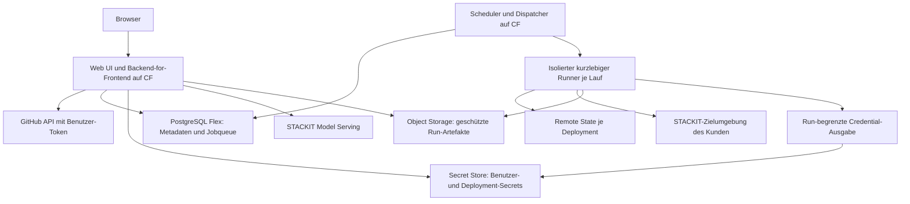
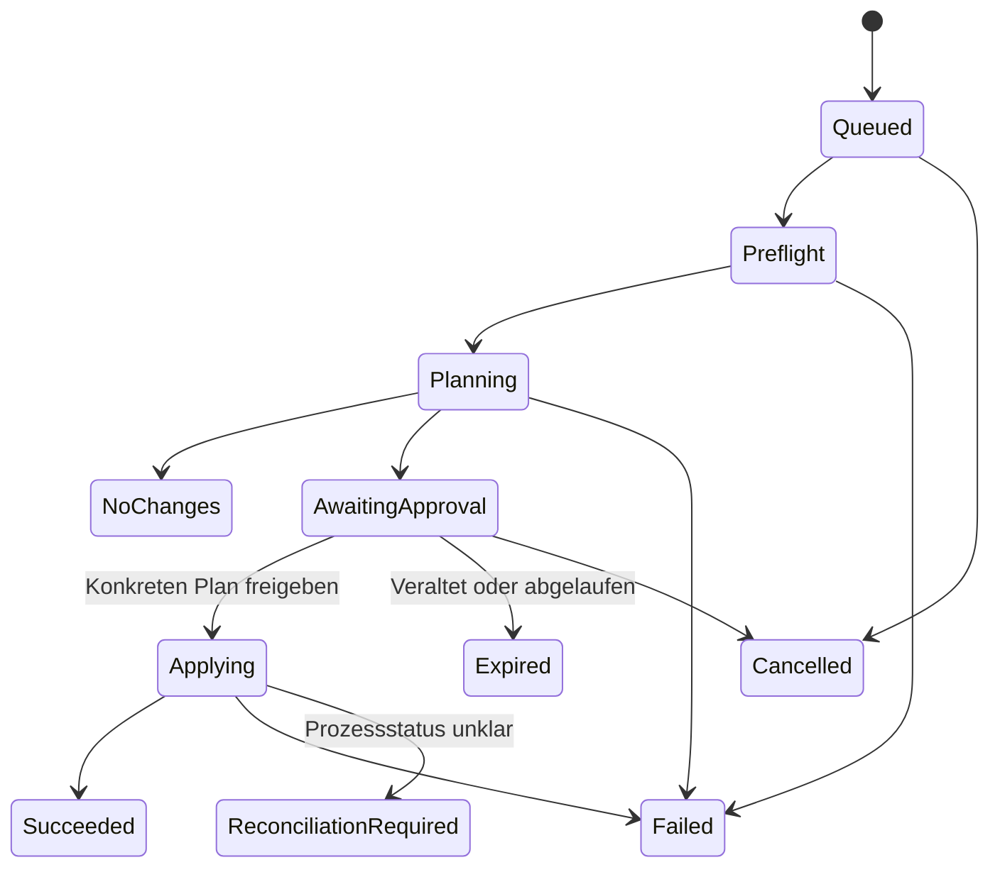

# Landing Zone Configurator – Architektur und Planung

> Stand: 2026-09-30 · Architektur-Ausgangsstand: `2161871`
> Status: Plattform, CF-App-Grundgerüst und Service-Anbindung implementiert und abgenommen. Fachlicher MVP noch offen.
> `[x]` = dokumentiert oder entschieden; `[ ]` = offen. Technische Empfehlungen sind noch keine beschlossenen Produktentscheidungen.

## Aktueller Umsetzungsschritt: GitHub-Login

Registrierung unter `lweberru` ist abgeschlossen. Sessions, PostgreSQL-RLS,
Secrets-Anbindung, Login/Logout-UI und separater Migrations-Task sind implementiert
und lokal sowie in CI geprüft. Migration und App-Release sind auf STACKIT erfolgreich;
Credential-Upload und CF-Backend-Bindung sind ausdrücklich freigegeben; GitHub-Login
ist live aktiviert und technisch geprüft. Persönliche Login-Abnahme ist bestätigt. Details und
Abhakliste: [GitHub-Login und Mandantentrennung](github-login.md).

### Aktueller Stand: Fork-Speicherung, Navigation und tfvars-Export

Fork-Auswahl, konfliktgeschützte Entwurfsablage im Arbeitsbranch und Wiederöffnen
sind implementiert und auf lzc-dev bereitgestellt. Ansichten und Editor-Schritte besitzen
eigene URLs mit live geprüfter Zurück/Vorwärts-Unterstützung. Der Benutzer bestätigt Fork-Erstellung, App-Zugriff und Speicherung. Ergänzt: Feldhilfen sowie native tfvars-Ausgabe neben dem bearbeitbaren JSON. Abnahme und Grenzen: [Forks und Navigation](forks-and-navigation.md).

### Aktueller Umsetzungsschritt: Zugangstest und Deployment-Vorbereitung

Persönliche Schlüsselablage ist durch den Benutzer bestätigt. Ergänzt sind der
Token-/Organisationszugriffstest, dauerhafte Prüfergebnisse und unveränderliche
Deployment-Vorbereitungen aus einer konkreten Fork-Revision. Prüfliste, Nachweise und
Grenzen: [Zugang prüfen und Deployment vorbereiten](deployment-preparation.md).
Plan/Apply, Kunden-Remote-State und Runner bleiben die folgenden Umsetzungsschritte.

## 1. Zielbild und bestätigte Entscheidungen

Eine zentral auf STACKIT Cloud Foundry gehostete Anwendung begleitet Benutzer vom Landing-Zone-Template bis zum überprüfbaren Deployment. Die Oberfläche arbeitet mit Organisationen, Netzwerkbereichen, Plattformdiensten und Workloads. Ein deterministischer Compiler übersetzt diese fachlichen Angaben in die Konfiguration des Accelerators. Terraform bleibt im Hintergrund; technische Details sind bei Bedarf einsehbar.

**Bestätigt im Planungsgespräch:**

- [x] Produktname: Landing Zone Configurator.
- [x] Sämtliche Configurator-Dienste inklusive Aktivierung werden via IaC erstellt; keine manuelle Portal-Provisionierung.
- [x] Erste Entwicklungsumgebung: lzc-dev in eu01.
- [x] App, IaC und Dokumentation unter `landing-zone-configurator/` getrennt vom Accelerator organisieren.
- [x] Betreiberprojekt und Service-Account-Datei sind lokal bereitgestellt; `NAME=WERT`-Format geprüft; Projektzugriff sowie Bereitstellung von Plattform und Runtime durch CI-Applies nachgewiesen.

- [x] Von Beginn an mehrere unabhängige Kundenorganisationen unterstützen. Mandantentrennung ist Voraussetzung der ersten Freigabe, kein späterer Ausbau.
- [x] Zunächst ausschließlich Konfigurationen verändern und mit freigegebenem Accelerator-Code ausführen. Eigene Terraform-Modifikationen aus Forks folgen später.
- [x] GitHub-Zugriffe erfolgen im Namen und mit Berechtigungen des Benutzers, ohne zentrale Repository-Credentials.
- [x] App-Hosting auf STACKIT Cloud Foundry; Plattformumgebung über IaC aufbauen.
- [x] STACKIT Model Serving als Chat-Backend; dessen Betreiber-Credentials serverseitig über CF-Variablen bereitstellen.

Die Betreiber benötigen technische Identitäten für CF, Datenbank, Secret-Verwaltung und Runner. Diese dürfen keine pauschale Berechtigung für Kunden-Repositories oder Kunden-Deployments haben. Die gewünschten zentralen Model-Serving-Credentials sind eine ausdrücklich abgegrenzte Betreiberfunktion.

### Anforderungskatalog

| ID | Fähigkeit | Einordnung |
| --- | --- | --- |
| F01 | GitHub-Login und benutzergebundene Repository-Zugriffe | Erste Version |
| F02 | Fork erstellen und mehrere vorhandene Repository-Verbindungen auswählen | Erste Version; GitHub-Grenzen berücksichtigen |
| F03 | Vorhandene `src/config/`-Beispiele als Templates anbieten und kopieren | Erste Version |
| F04 | Fachlicher Editor passend zu Modulen und Features | Schrittweise Umsetzung; Abdeckung sichtbar machen |
| F05 | Konfigurationen im ausgewählten eigenen Fork speichern | Erste Version |
| F06 | Persönliche Credentials und Deployment-Profile sicher verwalten | Vor erstem Deployment |
| F07 | Terraform/OpenTofu Plan und Apply visuell begleiten und ausführen | Kernumfang |
| F08 | Optionale Drift Detection und optionale Drift Correction | Nach stabilem Apply |
| F09 | Chat mit Rückfragen, vollständigem versionsbezogenem Feature-Wissen und Themenbegrenzung | Kernumfang |
| F10 | Grafische Konfigurationsdarstellung, später Plan-Delta und bekanntes Ist | Kernumfang |
| F11 | STACKIT-PaaS-Datenbank für Persistenz | Empfehlung: PostgreSQL Flex |
| F12 | Optionaler STACKIT-IdP-Login | Machbarkeit prüfen; keine MVP-Abhängigkeit |
| F13 | Model-Serving-Service als Voraussetzung und Plattformaufbau per IaC | Kernumfang |

## 2. Ausgangslage dieses Repositories

Grundlage sind [Root-Variablen](../../src/variables.tf), [Provider](../../src/providers.tf), [Engine-/Provider-Vorgaben](../../src/terraform.tf), [Backend-Beispiel](../../src/backend.tf), [Getting Started](../../docs/getting-started.md), [Architektur](../../docs/architecture.md), [mise.toml](../../mise.toml) und [Beitragsregeln](../../CONTRIBUTING.md).

### Template-Katalog

| Datei unter `src/config/` | Fachliche Darstellung |
| --- | --- |
| `standalone.tfvars` | Unabhängige Landing Zones ohne zentralen Netzwerk-Hub |
| `hub-and-spoke.tfvars` | Zentraler Netzwerk-Hub mit angebundenen Landing Zones |
| `hub-and-spoke-firewall.tfvars` | Hub-Spoke mit OPNsense-Firewall |
| `hub-and-spoke-multi-area.tfvars` | Getrennte Bereiche für regulierte und gemeinsame Workloads |
| `hub-and-spoke-finance-research.tfvars` | Getrennte Bereiche für Fachorganisationen |
| `hub-and-spoke-prod-nonprod-firewall.tfvars` | Getrennte Prod-/Nonprod-Bereiche mit Appliances |
| `hub-and-spoke-tenant-isolation.tfvars` | Netzwerkisolation innerhalb einer STACKIT-Organisation |
| `hub-and-spoke-multi-region.tfvars` | Regionale Hubs, Landing Zones und Plattformcluster in `eu01`/`eu02` |

**Wichtige Grenzen und Konsequenzen:**

- Templates enthalten Platzhalter und auskommentierte optionale Features. Ein HCL-Parser allein entdeckt daher nicht den gesamten Funktionsumfang. Ein expliziter Feature-Katalog ist nötig.
- `src/providers.tf` unterstützt statische regionale Aliasse für `eu01` und `eu02`. Die UI darf weitere Regionen nicht als automatisch unterstützt ausgeben.
- `connectivity_regions` ist als `map(any)` modelliert. Fachliche UI-Validierung muss über die Terraform-Typprüfung hinausgehen.
- Ein Projekt gehört gemäß Repo-Dokumentation zu genau einer SNA; mehrere SNAs oder Regionen sind nicht automatisch privat verbunden.
- `firewall_config` konfiguriert derzeit eine Appliance. Mehrere Appliances bedeuten keine automatische Policy-Verteilung. Dies bleibt eine sichtbare Einschränkung.
- Firewall-Bootstrap benötigt mehrere Schritte, ein Image und Shell-Werkzeuge. Die Anleitung beschreibt ein anfänglich öffentliches Admin-Interface mit gemeinsamem Initialpasswort. Automatisierte Freigabe erst nach sicherem Bootstrap und Passwortrotation.
- Private Firewall-/Kubernetes-Endpunkte benötigen passende Runner-Konnektivität. Zentraler CF-Betrieb allein stellt diese nicht her.
- Das Backend ist auskommentiert; die Anleitung migriert lokalen State erst nach der Erstbereitstellung in den erzeugten Management-Bucket. Kurzlebige Runner benötigen dagegen Remote State vor dem ersten Lauf.
- `mise.toml` pinnt OpenTofu `1.12.6`; `src/terraform.tf` verlangt mindestens `1.11`. README/Getting Started nennen teils abweichende Mindestversionen. Empfehlung: zunächst die gepinnte OpenTofu-Version qualifizieren; Terraform als weitere Engine separat testen.
- Das Repo verspricht keine pauschale Migrationskompatibilität. Upgrades brauchen explizite Migration, Versionsprüfung und neuen Plan.
- Die Netzwerkisolation des Templates „Tenant Isolation“ ersetzt nicht die Mandantentrennung der zentralen Anwendung.

## 3. Zielarchitektur

Empfehlung: modularer Backend-Dienst mit klaren internen Grenzen; Terraform-Ausführung als getrennte Laufzeit. Keine unnötige Aufteilung in viele Microservices zum Start.



| Baustein | Empfehlung | Verantwortung |
| --- | --- | --- |
| Frontend | React/TypeScript mit Vite; Graph-Bibliothek noch auswählen | Wizard, Fachformulare, Topologie, Chat und Run-Ansicht |
| Backend/BFF | TypeScript mit Fastify auf Node.js 24 LTS | Sessions, Autorisierung, GitHub, Konfiguration, Chat-Orchestrierung |
| HCL-Adapter | Kleiner Go-Adapter mit HCL-Parser | Bestehende `.tfvars` strukturiert lesen, keine Regex-Konvertierung |
| Konfigurationskern | Versioniertes JSON Schema, Fachregeln und Compiler | Gemeinsamer Vertrag für Editor, Import, Chat und Ausgabe |
| Datenbank | STACKIT PostgreSQL Flex | Mandanten, Entwürfe, Revisionen, Runs, Audit und Queue |
| Scheduler/Queue | Durable PostgreSQL-Queue und separater CF-Prozess | Leases, Heartbeats, Wiederaufnahme, faire Mandantenquoten |
| Secrets | STACKIT Secrets Manager, nach Prüfung der erforderlichen Policies | DB enthält Referenzen; keine Klartext-Credentials |
| Artefakte | STACKIT Object Storage | Geschützte Plans, bereinigte Logs und Laufmanifest |
| Runner | Unveränderliches Artefakt mit gepinnter Engine und Providern | Nur Credentials des konkreten Deployments |
| Chat | STACKIT Model Serving über Backend | Beratung und validierte Vorschläge; keine Ausführungsrechte |

PostgreSQL Flex ist als verwalteter Dienst dokumentiert und unterstützt Verwaltung über Terraform und Cloud Foundry. Konkrete Region, Plan, HA, Backup, ACLs und CF-Anbindung sind vor Provisionierung festzulegen. [PostgreSQL Flex](https://docs.stackit.cloud/products/databases/postgresql-flex/)

### CF-Hosting und Runner

Web/API sowie Scheduler/Dispatcher laufen auf CF. Sessions und Jobs werden extern gespeichert. Mehrere Web-Instanzen, Health Checks, DB-Pooling und rückwärtskompatible DB-Migrationen vorsehen. SSE für Fortschritt/Chat, Polling als Rückfalloption; Proxy-Timeouts und Wiederverbindung testen.

STACKIT dokumentiert für Prozesse/Tasks bis zu 32 GB RAM und 6 GB flüchtigen lokalen Speicher. Das lokale Dateisystem ist nicht persistent. Diese Grenzen sind besonders für Provider-Binaries, Firewall-Image und Plan-Artefakte zu prüfen. [Anwendungsanforderungen](https://docs.stackit.cloud/products/runtime/cloud-foundry/basics/requirements-for-applications/)

CF Tasks laufen in eigenen Containern, erben aber Umgebungsvariablen, Bindings und Security Groups ihrer App. Deshalb **keine Terraform-Task der Backend-App** starten. Empfohlen ist eine eigene Runner-App ohne Backend-Bindings, bei Bedarf mit separaten Apps/Spaces pro Kunde. Ob dies die geforderte Isolation und private Erreichbarkeit bietet, ist durch Tests zu belegen. Logs von Tasks fließen in die App-Logs; Redaktion muss deshalb vor stdout/stderr erfolgen. [CF Tasks](https://docs.cloudfoundry.org/devguide/using-tasks.html)

Falls CF-Ressourcenlimits, Netzwerk oder Isolation nicht genügen: isolierte Jobs auf SKE oder kurzlebige Compute-Runner. Für private Ziele gegebenenfalls Runner im Kundennetz mit ausgehender Verbindung zur Steuerung. Die Webanwendung bleibt auf CF. Diese Erweiterung benötigt eine explizite Architekturentscheidung.

**Freigabekriterium:** Ein Runner erreicht weder andere Kunden-Secrets/States noch Model-Serving-Credentials oder die App-Datenbank. Eigener Ordner allein genügt nicht. Auch freigegebener Terraform-Code führt Provider und teilweise Skripte aus.

## 4. Mandantenmodell und Berechtigungen

Ein Tenant repräsentiert eine Kundenorganisation. Darunter liegen Workspaces, Repository-Verbindungen, Konfigurationen und Deployments. Benutzer können Mitglied mehrerer Tenants sein; der aktuelle Kontext muss im UI jederzeit sichtbar sein. GitHub-Organisation, App-Tenant und STACKIT-Organisation sind unterschiedliche Objekte mit expliziter Zuordnung.

Empfehlung für den Start: gemeinsame PostgreSQL-Instanz mit `tenant_id` auf allen Kundenobjekten und Row-Level Security als zusätzliche Schutzschicht. Rollen und DB-Zugänge so gestalten, dass der Anwendungspfad RLS nicht umgeht. Separate Datenbanken/Instanzen für erhöhte Isolationsanforderungen als spätere Betriebsoption. Secrets, State, Artefakte, Queue, Caches und Chat-Verlauf brauchen dieselbe Trennung; ein DB-Filter alleine reicht nicht.

- Tenant-Mitgliedschaft nur durch bestätigte Einladung/Administration oder verifizierte Organisationszuordnung; keine automatische Zuordnung anhand einer E-Mail-Domain.
- Rollen: Viewer, Editor, Deployer, Tenant-Admin. Credential-Nutzung wird zusätzlich autorisiert.
- GitHub-Rechte bei Repository-Aktionen weiterhin prüfen; eine App-Rolle erweitert keine GitHub-Berechtigung.
- Persönliche Credentials sind standardmäßig privat. Freigabe an Workspace oder Hintergrundjob braucht eine explizite, widerrufbare Delegation.
- Jeder Request und jeder Job wird serverseitig auf Tenant, Workspace und Objekt autorisiert. IDs im Request sind kein Berechtigungsnachweis.
- Rate Limits, aktive Runner, Queue-Anteil, Artefaktspeicher und KI-Budget pro Tenant begrenzen; kein Kunde darf alle Kapazitäten belegen.
- Betreiberzugriffe als nachvollziehbaren Notfallprozess gestalten. Keine normale Support-Oberfläche zur Anzeige von Kundensecrets.
- Bereits vor erster externer Freigabe Negativtests für horizontale Zugriffe, fremde Job-IDs, Artefakt-URLs, Cache-Schlüssel, Secret-Referenzen und Chat-Sessions.

## 5. Benutzerablauf

1. **Anmelden und Tenant wählen:** GitHub verbinden, eigenen Kundenkontext erstellen oder Einladung annehmen.
2. **Repository auswählen:** vorhandenen zugänglichen Fork auswählen oder einen neuen erstellen; Schreibrechte prüfen.
3. **Template kopieren:** Zielbild, Features, Grenzen und Voraussetzungen sehen; eigene Konfigurations-ID und Name vergeben.
4. **Gestalten:** Wizard oder Chat; beide arbeiten auf demselben fachlichen Modell. Topologie reagiert auf validierte Änderungen.
5. **Überprüfen und speichern:** Diff zeigen; Repository, Branch und Pfad sichtbar machen; Git-Commit oder optional PR erstellen.
6. **Deployment vorbereiten:** Zielorganisation, Region, Credential-Profil, Remote State und Runner-Netz prüfen.
7. **Plan:** feste Revision verwenden; Create/Update/Delete/Replace fachlich erklären.
8. **Apply:** konkreten Plan ausdrücklich freigeben; Fortschritt und Fehler verfolgen.
9. **Betrieb:** zuletzt erfolgreich ausgerollte Revision, letzten bekannten Ist-Stand und optionale Drift-Prüfungen sehen.

Navigation: Dashboard, Templates, Konfigurationen, grafischer Editor mit Chat, Repository-Verbindungen, Deployment-Profile, persönliche Credentials, Runs/Drift und Tenant-Verwaltung. Begriffe wie „Netzwerkbereich“ ersetzen Terraform-Variablennamen im normalen Ablauf. Technische Details bleiben für Diagnose und Export verfügbar.

## 6. GitHub und Login

### Benutzergebundener Zugriff

Empfehlung: GitHub App mit User Authorization und User Access Tokens. Jeder Benutzer autorisiert die App selbst. Repository-Aktionen nutzen ausschließlich seinen Token, keine Installation Tokens und keinen zentralen PAT. Die Rechte sind durch Benutzerrechte, App-Berechtigungen und Installation begrenzt. [Benutzerbezogene GitHub-App-Authentisierung](https://docs.github.com/en/enterprise-cloud%40latest/apps/creating-github-apps/authenticating-with-a-github-app/authenticating-with-a-github-app-on-behalf-of-a-user)

OAuth-State, sichere Callback-Allowlist, unterstütztes PKCE, CSRF-Schutz und sichere HttpOnly-/Secure-/SameSite-Sessions vorsehen. Tokens nur serverseitig im Secret Store halten. Ablauf, Refresh, Widerruf, SSO und Organisationsrichtlinien testen. Repo-Zugriffe nach Rechteentzug blockieren. Repositories über stabile GitHub-IDs referenzieren.

**Wichtige Fork-Voraussetzung:** Laut GitHub benötigt das Fork-API bei GitHub Apps eine Installation am Zielaccount mit Zugriff auf alle Repositories sowie eine Installation am Quellaccount mit Zugriff auf das Quellrepo. Für diesen Endpunkt sind `Administration: write` und `Contents: read` angegeben. Die Erstellung läuft asynchron. Das ist ein zentraler Onboarding-Prüfpunkt, insbesondere für den Upstream `stackitcloud/stackit-landing-zone`. [Fork-API](https://docs.github.com/en/rest/repos/forks)

Im Spike die vollständige Berechtigungsmatrix für Fork, Lesen, Branch/Commit und optional PR prüfen. Falls die nötige Quellinstallation oder Zielberechtigung nicht verfügbar ist: geführtes manuelles Forken in GitHub und anschließendes Verbinden; alternativ separat bewertete OAuth-App. Kein stiller Wechsel auf zentrale Credentials. Eine OAuth-App kann breitere Scopes benötigen; daher keine voreilige Festlegung nur aufgrund des einfacheren Fork-Ablaufs. [GitHub Apps und OAuth Apps](https://docs.github.com/en/apps/oauth-apps/building-oauth-apps/differences-between-github-apps-and-oauth-apps)

### Mehrere Forks und Speichern

Mehrere Repository-Verbindungen pro Benutzer/Tenant unterstützen, beispielsweise persönlicher Fork und Forks in berechtigten Organisationen. Nicht zusagen, dass beliebig viele echte Forks desselben Upstreams im selben Owner-Namespace möglich sind: die aktuelle Fork-Netzwerkgrenze im Spike prüfen. Mehrere Konfigurationen/Branches in einem Fork sind die bevorzugte Alternative; eine eigenständige Repository-Kopie wäre separat anzubieten und kein echter Fork.

Fork-Erstellung idempotent behandeln, Bereitschaft pollen und Fehler verständlich anzeigen. Beim Speichern mehrere Dateien atomar committen und die erwartete Basisrevision prüfen. Konflikte nicht überschreiben. Geschützte Branches über Arbeitsbranch/PR bedienen. Webhooks signiert und idempotent verarbeiten; sie erlauben keinen automatischen Apply.

### Optionaler STACKIT-IdP

Die gefundene STACKIT-Anleitung beschreibt Federation, bei der STACKIT als Relying Party einem externen IdP vertraut. Sie belegt **nicht**, dass Kunden eine eigene Web-App unkompliziert als OIDC-Client des STACKIT-IdP registrieren können. Daher Client-Registrierung, Discovery, Claims und Nutzungsfreigabe separat klären. GitHub bleibt der initiale Login. [STACKIT-IdP-Einstieg](https://docs.stackit.cloud/platform/access-and-identity/stackit-idp/getting-started/)

Zusätzlicher IdP-Login erteilt weder GitHub- noch Cloud-API-Rechte. GitHub-Verbindung bleibt nötig. Identitäten nur nach Nachweis beider Konten verknüpfen, niemals allein über gleiche E-Mail-Adressen.

## 7. Fachmodell, Templates und Compiler

### Versionierte Ablage

Vorschlag für UI-Konfigurationen im ausgewählten Fork:

```text
src/config/custom/<config-id>/
  landing-zone.json          # kanonisches Fachmodell, ohne Secrets
  landing-zone.tfvars       # deterministisch erzeugte Terraform-Eingaben
  manifest.json             # Schema-, Compiler-, Template-/Accelerator-Versionen
```

Das Fachmodell ist die Quelle für UI-verwaltete Konfigurationen. Die generierte Datei ermöglicht weiterhin CLI-Nutzung. Vor Runs neu kompilieren und Hash vergleichen; manuelle Änderungen an generierten Dateien als Konflikt behandeln. Originale `.tfvars` bleiben erhalten. Importbericht für unbekannte Felder und Kommentarverlust; keine stillschweigende Löschung nicht unterstützter Einstellungen.

Manifest: Template-Pfad/-Commit, Accelerator-Commit/Release, Schema-/Compiler-Version und Content-Hashes. Deployment-Bindings und Secret-Referenzen liegen außerhalb von Git. DB-Entwürfe sind nicht „gespeichert“, bevor der Git-Commit erfolgreich war. Runs verwenden ausschließlich unveränderliche Git-Revisionen.

Der Template-Katalog startet mit den acht Upstream-Dateien einer freigegebenen Version. Fork-spezifische Konfigurationen sind eigene Konfigurationen und nicht automatisch vertrauenswürdige globale Templates. Upstream-Updates zunächst als explizites Upgrade mit Diff und Migration anbieten. Rollback einer Konfiguration bedeutet neue Revision und neuen Plan, nicht automatischen Infrastruktur-Rollback.

### Feature-Katalog

| Fachbereich | Repo-Bezug | UI-Verhalten und Regeln |
| --- | --- | --- |
| Organisation | Owner, Firma/-code, Organisations-ID, Labels, Parent-Folder | Pflichtwerte, Platzhalter ersetzen, gültige Referenzen |
| Governance | `rm_folders`, Organisationseigentümer/-auditoren, Rollen | Hierarchie und Rollenmodell |
| Management | State-Bucket, Secrets Manager, Service Accounts, Federation | Bootstrap- und Betriebsidentität unterscheiden |
| Observability/Audit | `observability`, `audit_logs` | Retention, Zugriff, Folgen von Object Lock erklären |
| Konnektivität | `connectivity`, `connectivity_regions` | SNA, CIDRs, DNS, regionale Zuordnungen |
| Firewall/VPN | Firewall/HA, `firewall_config`, VPN | Erreichbarkeit, Bootstrap und Grenzen der Traffic-Inspektion |
| Landing Zones | `landing_zones`, Modul `landing-zone` | Projekte, Owner, Umgebung, RBAC, Netz, DNS, Buckets, Secrets |
| Kubernetes-Plattform | `platform_kubernetes` | Cluster, Node Pools, Netz, verschlüsselte Volumes, Bastion |
| Kubernetes-Services | `landing_zone_namespace_services`, Namespace-Demo, Root-Kubernetes-Ressourcen | Plattformabhängigkeiten und erreichbarer API-Endpunkt |
| DevOps | `devops` | Git-Service und zulässige Netzwerkbereiche |
| Sandboxes | `sandboxes` | Projekt und Owner |

Jedes Feature erhält eine stabile ID, Fachtext, Mapping, Defaultwerte, Abhängigkeiten, Regionsgrenzen, Secret-Bedarf, Compiler-Regeln, Grafik-Semantik und Tests. Struktur teilweise aus HCL ableiten; Fachtexte/Abhängigkeiten explizit pflegen. CI meldet Änderungen an Variablen/Modulen ohne aktualisierten Katalog.

Validierung: Referenzen zwischen Bereichen/Landing Zones/Clustern, Namensregeln, unterstützte Regionen und Kombinationen, CIDR-Konflikte in verbundenen Netzen. Wiederverwendete Adressbereiche in tatsächlich isolierten Netzen gesondert bewerten. Stabile Terraform-Ressourcenschlüssel erhalten; eine Umbenennung darf kein unsichtbares Destroy/Create erzeugen.

Pro Feature getrennt kennzeichnen: **darstellbar, editierbar, planbar, ausführbar**. Ein importierbares Firewall-Template ist noch nicht vollständig automatisiert deploybar.

### Grenze zum Terraform-Code

Der Compiler erzeugt nur Daten, keine frei eingegebenen HCL-Ausdrücke oder Shell-Kommandos. Im MVP wird Accelerator-Code anhand eines freigegebenen Commits materialisiert; aus dem Benutzer-Fork werden nur erlaubte Konfigurationsdateien gelesen. Abweichende Module klar melden. Keine beliebigen `.auto.tfvars`, Provider, Backend-Dateien oder Skripte aus Forks implizit mitladen.

Eigener Terraform-Code ist ein späterer Vertrauensmodus mit stärkerer Isolation und expliziten Provider-/Modul-/Netzrichtlinien. Die aktuelle Einschränkung sichtbar machen, weil das Repo grundsätzlich Modul-Anpassungen vorsieht.

## 8. Credentials und Persistenz

| Kategorie | Ablage / Eigentümer | Verwendung |
| --- | --- | --- |
| GitHub User-/Refresh-Token | Secret Store, persönlicher Benutzer | Repository-Zugriff im Benutzerauftrag |
| STACKIT Service Account Key bzw. unterstützte Federation | Persönliches oder explizit geteiltes Deployment-Profil | Zugeordnetes Kunden-Deployment |
| S3-Backend-Zugang | Deployment-Profil | Genau zugehöriger State-Bereich |
| VPN-PSKs, Firewall-Login/API-Key, ggf. Kubeconfig | Secret Store je Deployment | Nur benötigte Laufphase |
| Model-Serving-Token | Betreiber, CF-Variablen des Backends | Chat-Service |
| CF-/DB-/Secret-Betriebsidentität | Betreiber | Plattformbetrieb, keine Kunden-Cloud-Vollmacht |

„Credentials anlegen“ bedeutet zuerst Profil erstellen und vorhandene Credentials sicher hinterlegen. Neue STACKIT-Service-Accounts/Schlüssel kann die App nur mit explizit delegierten Cloud-Rechten erzeugen; GitHub-Login genügt nicht. Später kurzlebige Federation bevorzugen, sofern die benötigten Flows unterstützt sind.

STACKIT Secrets Manager auf Mandanten-Policies, Credential-Lifecycle und runbezogene Ausgabe prüfen. Keine Annahme, dass beliebige Vault-Features im Managed Service verfügbar sind. Bei fehlenden Fähigkeiten eine explizite Alternative entscheiden, z. B. tenantgetrennte Secret-Instanzen oder geprüfte Envelope-Verschlüsselung mit separat verwalteten Schlüsseln; kein unverschlüsselter DB-Fallback.

Runner erhalten nur ein kurzlebiges, auf Run und Secret-Version begrenztes Ausgabeticket. Kein allgemeines Secret-Store-Token. Persönliche Profile zeigen Status, Zweck, Ablauf und „Ersetzen/Widerrufen“, keine Rohwerte. Rotation, Backup, Wiederherstellung und Notfallzugriff planen.

`Sensitive`-Markierungen verhindern nicht, dass Terraform-State oder gespeicherte Plans Secrets enthalten. Diese Artefakte wie Secrets schützen. Browser, Git, Chat, Audit und normale Logs erhalten keine Roh-Secrets. Frei angegebene Endpoints gegen SSRF absichern; Zielnetze per Profil freigeben statt beliebige interne Adressen vom Backend anzusprechen.

### Datenmodell

Alle Kundenobjekte tragen `tenant_id`, gegebenenfalls `workspace_id`, serverseitig geprüft.

| Entität | Inhalt |
| --- | --- |
| User / Identity / Session | Interne UUID, Provider-ID, verknüpfte Identitäten, Session-Lifecycle |
| Tenant / Workspace / Membership | Kundenkontext, Mitgliedschaft, Rollen und Einladungen |
| RepositoryConnection | GitHub-ID, Benutzerautorisierung, Branch, Zugriffsstatus |
| TemplateVersion | Pfad/Commit, Metadaten, unterstützte Features |
| Configuration / Revision | Fachmodell, Schema, Git-Ziel, Basis-SHA und Speicherstatus |
| CredentialProfile / Delegation | Secret-Referenz/-Version, Besitzer, erlaubte Nutzung, Ablauf |
| Deployment | Revision, Zielorganisation, Backend-/State-ID und Runner-Profil |
| Run / Approval / Artifact | Status, Manifest, Plan-Hash, Freigabe, Ergebnis und Artefaktreferenzen |
| DriftSchedule / DriftFinding | Opt-in, Referenzrevision, Prüfung und Korrekturpolicy |
| ChatSession / Proposal | Versionskontext, Rückfragen, Patch und Übernahmezustand |
| AuditEvent | Akteur, Aktion, Ressource, Zeit, Ergebnis; keine Secret-Werte |

Retention getrennt für Chat, Logs, Plans, Audit und State festlegen. State niemals mit normaler Artefaktbereinigung löschen. Konto-/Konfigurationslöschung zerstört keine Infrastruktur; Offboarding umfasst Export von Konfiguration/State, Entzug von Zugängen und dokumentierte Löschung verbleibender Daten.

## 9. Plan, Apply und State

### Unveränderlicher Laufvertrag

Jeder Run bindet Tenant, Deployment, Git-Commit, Config-Hash, Accelerator-Commit, Schema-/Compiler-Version, Engine-Version, Provider-Lockfile, Runner-Artefakt-Digest, Backend-/State-ID und relevante Credential-Versionen.



1. Berechtigung, Profil, Kompatibilität, Quota, Backend und Erreichbarkeit prüfen.
2. Geprüften Code und genau eine ausgewählte Konfiguration materialisieren; Backend-Einstellungen ohne Secrets im Git erzeugen.
3. `init` mit festgelegtem Backend und gepinnten Providern; `validate` und Fach-/Policy-Prüfungen.
4. `plan -out=<planfile> -detailed-exitcode`: 0 = keine Änderungen, 2 = Änderungen, 1 = Fehler. CLI-Vertrag mit gepinnter Engine testen.
5. `show -json` auswerten, sensible Werte anhand der Sensitivitätsmarkierungen und zusätzlicher Regeln redigieren. Roh-JSON nie direkt an Browser oder Chat geben.
6. Create/Update/Delete/Replace und unbekannte Werte zeigen; Auswirkungen auf Fachobjekte erklären. Kosten nur bei belastbarer Datenquelle als Schätzung kennzeichnen.
7. Freigabe an Plan-Hash und Manifest binden; Genehmiger und Zeitpunkt protokollieren. Tenant-Policy kann Vier-Augen-Freigabe verlangen.
8. Exakt den gespeicherten Binär-Plan mit gleicher Engine/Plattform anwenden. Geänderte Revision, State oder relevante Ausführungsbedingungen erfordern neuen Plan und neue Freigabe.
9. Ergebnis, State-Version und bereinigte Outputs persistieren; temporäre Secrets/Dateien entfernen.

Plan-Gültigkeit begrenzen. Cloud-Änderungen außerhalb des Systems können während der Freigabezeit stattfinden; State-Vergleich allein erkennt nicht alles. Bei erkanntem Risiko neu planen. Kein unbemerkter Re-Plan zwischen Freigabe und Apply.

### Remote State und Sperren

Entscheidung 2026-09-30: dem vorhandenen LZA-Bootstrap folgen. Der erste Plan einer
expliziten Neuanlage verwendet lokalen leeren State und die bereits hinterlegten
Bootstrap-Credentials. Beim separat freigegebenen ersten Apply erstellt das Management-
Modul das spätere Kunden-Backend. Danach State exklusiv mit `tofu init -migrate-state`
migrieren, überprüfen und auf den Management-Service-Account wechseln.

Der Configurator muss den anfänglichen State dauerhaft und verschlüsselt sichern,
auch bei Runner-Verlust und partiellem Apply. Diese Recovery ist Voraussetzung für
Apply. Vorhandene Deployments dürfen nie als neue leere States geplant werden.
Kein zusätzlicher dauerhafter zentraler Kunden-State-Bucket. Plattform-IaC und
Kunden-Deployments teilen niemals einen State. [Details](plan-execution.md).

- Backend-Locking mit gewählter Engine und STACKIT Object Storage praktisch testen, einschließlich konkurrierendem CLI-Zugriff. S3-Kompatibilität ist kein Locking-Nachweis.
- Zusätzlich DB-Lease pro kanonischer State-ID; doppelte Deployment-Registrierung desselben States verhindern. Lease ersetzt Backend-Lock nicht.
- Versionierung, Verschlüsselung, Restore-Test und protokollierte manuelle Entsperrung vor Produktivfreigabe.
- Bei Runner-Absturz nicht blind erneut Apply ausführen. Prozessstatus, Lock und State abgleichen; gegebenenfalls neuen Plan erstellen.
- Apply kann teilweise erfolgreich sein. Kein automatischer Rollback; Wiederherstellung über neuen Plan. Abbruch ist best effort und kann Teiländerungen hinterlassen.
- Ein Deployment entspricht zunächst einem Accelerator-Root. Größere State-Aufteilung benötigt gesonderte Migrations- und Abhängigkeitsplanung.

### Spezielle Runbooks

Firewall-Bootstrap, Policy-Konfiguration, Secret-Übergabe, HA und gegebenenfalls Kubernetes-Provider-Bootstrap als versionierte Abläufe implementieren. Jede schreibende Phase mit verändertem Plan benötigt eine passende Freigabe. Kein UI für beliebige `-target`-Argumente.

Für Firewall: Image-Herkunft/Prüfsumme, Speicherbedarf, Werkzeuge, private API-Erreichbarkeit, Passwortrotation und TLS-Verifikation testen. Abbruch während offenem Admin-Interface muss sichtbar sein und eine konkrete Absicherungs-/Wiederaufnahmeanleitung bieten. Ohne erfolgreichen Nachweis diese Variante nicht als automatisiert ausführbar freigeben.

## 10. Drift Detection und Correction

Pro Deployment: Aus, nur erkennen, nach Freigabe korrigieren, später eng begrenzte automatische Korrektur. Standard: Aus. Hintergrundnutzung von Credentials benötigt eine explizite widerrufbare Delegation, getrennt von einer interaktiven Session.

- Referenz ist die zuletzt erfolgreich ausgerollte Git-/Accelerator-Revision, nicht der aktuelle Branch-Head.
- Refresh-only-Plan kann Unterschiede zwischen Cloud und State zeigen. Normaler Plan gegen dieselbe Revision zeigt die zur Soll-Wiederherstellung nötigen Änderungen. Beide Aussagen unterscheiden.
- Kein automatisches `apply -refresh-only`, um Befunde lediglich verschwinden zu lassen.
- Zeitpläne mit Jitter, Backoff, Mandantenquoten und Lauf-Sperren; keine Prüfung parallel zu schreibendem Run desselben States.
- API-Fehler oder abgelaufene Credentials bedeuten „Prüfung fehlgeschlagen“, nicht „keine Drift“.
- Correction stellt den genehmigten Sollzustand her. „Ist als Soll übernehmen“ ist separate Konfigurationsänderung mit Git-Commit und Review.
- Automatische Correction nur nach ausdrücklichem Opt-in mit testbarer Allowlist, Wartungsfenster, Ressourcenlimit, Audit und Not-Aus.
- Delete/Replace, IAM, Firewall-/Routing-Änderungen, Secret-Rotation und unbekannte Aktionen zunächst immer freigabepflichtig.
- Nach Fehlern pausieren statt Endlosschleife; neue Konfigurationsänderungen nie als Drift-Korrektur einschleusen.

## 11. Chatbot mit STACKIT Model Serving

### Fachlicher Vertrag

Der Chat behandelt ausschließlich Planung und Konfiguration des versionsgebundenen Accelerators. Er erklärt Features und Grenzen, fragt aktiv fehlende Informationen ab und erzeugt überprüfbare Änderungen. Außerhalb dieses Bereichs führt er zum unterstützten Thema zurück.

Wissen: Feature-Katalog, Schema, freigegebene Repo-/Moduldokumentation und Templates der gewählten Version. Kein beliebiger Web-/Repository-Zugriff. Dokumentverweise in Antworten; unbekannte Features nicht erfinden. Systemprompt alleine garantiert die Einschränkung nicht: Tool- und Datenzugriffe im Backend erzwingen.

Ablauf:

1. Benutzer beschreibt sein Ziel.
2. Backend liefert minimale secretfreie Konfiguration und relevante versionierte Wissensabschnitte.
3. Chat fragt notwendige Angaben ab: Owner, Organisation, Regionen, Isolation, Netzplanung. Widersprüche erklären, etwa getrennte SNAs bei gleichzeitig gewünschtem gemeinsamen privaten Git-Service.
4. Modell erzeugt `questions`, `assumptions`, `patch`, `explanation`, `references`.
5. Backend prüft Schema/Fachregeln und Basisrevision des Patches.
6. UI zeigt Diff und Topologie-Vorschau. Erst „Übernehmen“ ändert den Entwurf; Git-Speichern, Plan und Apply sind separate Aktionen.

Erlaubte interne Werkzeuge: Features nachschlagen, bereinigte Konfiguration lesen, Patch vorschlagen/validieren. Kein Secret-Lesen, Shell, Git-Schreiben oder Apply durch das Modell. Repo-Kommentare und Freitext gelten als untrusted input. Keine fremden Tenant-Daten, Credentials, States oder Roh-Plans im Modellkontext.

### Anbindung und Betrieb

STACKIT dokumentiert eine OpenAI-kompatible Inferenz-API mit Auth-Token. Die API hält keinen Gesprächszustand; das Backend verwaltet den nötigen Kontext selbst. [Modelle verwenden](https://docs.stackit.cloud/products/data-and-ai/ai-model-serving/how-tos/use-the-models/)

Voraussetzung: STACKIT-Projekt mit aktiviertem AI Model Serving, ausgewähltem Modell, Kapazität und Inferenz-Token. Token-Erzeugung benötigt eine separate STACKIT-Autorisierung; Inferenz-Token nicht mit allgemeinen STACKIT-Credentials verwechseln. [Auth-Tokens](https://docs.stackit.cloud/products/data-and-ai/ai-model-serving/how-tos/manage-auth-tokens/)

Vorgeschlagene app-eigene CF-Variablen:

```text
MODEL_SERVING_BASE_URL
MODEL_SERVING_MODEL
MODEL_SERVING_API_KEY
MODEL_SERVING_TIMEOUT_SECONDS
```

Der dokumentierte Shared-Model-Einstieg verwendet `https://api.openai-compat.model-serving.eu01.onstackit.cloud/v1/chat/completions`. Endpoint/Modell aus der gewählten Service-Konfiguration übernehmen; nicht den Management-API-Endpoint für Inferenz nutzen. Modellfähigkeiten wie Tool Calling/strukturierte Ausgabe separat evaluieren. [Shared Models starten](https://docs.stackit.cloud/products/data-and-ai/ai-model-serving/getting-started/getting-started-with-shared-models/)

Credentials ausschließlich auf Backend/Chat-App setzen, nie ins Frontend-Build oder Runner. CF-Umgebungsvariablen sind für entsprechend berechtigte Space-Developer lesbar; diese gehören damit zur Betreiber-Vertrauensgrenze. Über geschützte Deployment-Injektion setzen, nicht in Git-Manifeste schreiben; Rotation und Redaktion testen. [CF-Variablen und Secrets](https://docs.stackit.cloud/products/runtime/cloud-foundry/how-tos/manage-environment-variables-and-secrets/)

Token-/Kostenlimits pro Tenant, Timeouts, begrenzte Reparaturversuche für ungültiges JSON und Circuit Breaker. Bei KI-Ausfall bleibt der manuelle Editor nutzbar. Gesprächsaufbewahrung, Löschung und übermittelte Organisationsdaten transparent machen. Tenant-Chatdaten nicht in einen gemeinsamen Wissensindex übernehmen.

Evaluationsfälle: fehlende Pflichtfelder, widersprüchliche Netze, unbekannte Features, Themenwechsel, Prompt Injection, Secret-Offenlegung, fremde Tenants, veraltete Revisionen und ungültige Ausgabe. Der Chat gilt erst mit gemessenen Akzeptanzkriterien als freigegeben.

## 12. Grafische Darstellung

Ein deterministischer Graph-Builder verwendet dasselbe validierte Fachmodell wie der Compiler. Kein frei vom Sprachmodell gezeichnetes Infrastrukturdiagramm.

- Gruppierung: Organisation → Region → Netzwerkbereich → Projekte/Landing Zones → Dienste.
- Knoten für Management, DevOps, Plattformcluster, Firewall, VPN, DNS und Sandboxes.
- Kanten für echte Beziehungen: SNA-Anbindung, Default Route, Cluster-Zuordnung, explizite VPN-Verbindung. Keine impliziten Verbindungen zwischen SNAs/Regionen.
- Getrennte Ansichten: Konfigurations-Soll, Plan-Delta und zuletzt bekannter Ist-/State-Stand mit Zeitstempel. State ist kein Echtzeit-Monitoring.
- Create/Update/Delete/Replace sowie unbekannte Werte durch Symbol und Farbe markieren.
- Plan-Ressourcen über versioniertes Mapping Features zuordnen; nicht zuordenbare Ressourcen bleiben technisch sichtbar.
- Knoten öffnen Fachformulare. Freies Zeichnen von Beziehungen erst später mit denselben Validierungsregeln.
- Tastaturbedienbare Listen-/Tabellenalternative; secretfreier Grafikexport als Ausbau.

## 13. IaC, Lieferung und Betrieb

Das getrennte Verzeichnisgerüst und die lokale App-Entwicklungsbasis sind angelegt; Bootstrap-, Backend- und Plattform-IaC sind implementiert; noch kein Cloud-Apply. Details stehen in der [Configurator-README](../README.md). Die [Sprachentscheidung](decisions/0001-application-stack.md) ist als angenommen dokumentiert.

```text
landing-zone-configurator/
  app/apps/{web,api,worker}/
  app/packages/{domain,contracts}/
  tools/hcl-adapter/
  runner/
  infra/{bootstrap,backend,platform,modules,environments}/
  deploy/cloud-foundry/
  docs/decisions/
```

Die lokal bereitgestellten Dateien `landing-zone-configurator.env` und `landing-zone-configurator-credentials.json` bleiben im Repository-Root und sind von Git ausgeschlossen. Sie betreffen die Betreiberplattform, nicht Kunden-Deployments. Werte nicht in Dokumentation, Manifeste oder Git übernehmen. Die `.env` verwendet nach Benutzerkorrektur das geprüfte `NAME=WERT`-Format. Erkannte Variablennamen: `PROJECT_ID`, `ORGANISATION_ID`. Vor IaC-Nutzung das Mapping zu den Plattformvariablen festlegen. Zielprojekt-Lesezugriff und ausgewählte Dienst-Metadaten wurden geprüft; Schreibrechte sind noch nicht nachgewiesen. Siehe [Plattformprüfung](platform-check.md).

App-Infrastruktur und Kunden-Landing-Zones haben getrennte States, Credentials und Release-Zyklen. Die App darf nicht von einer Landing Zone abhängen, die erst durch dieselbe App erzeugt werden müsste. STACKIT dokumentiert CF-Provisionierung via Terraform; die konkrete Ressourcenabdeckung ist dennoch im Spike nachzuweisen. [CF mit Terraform](https://docs.stackit.cloud/products/runtime/cloud-foundry/how-tos/provision-cloud-foundry-via-terraform/)

### Plattformaufbau

- [ ] Betreiberprojekt, Region, CF-Org/-Spaces, Quoten und Betriebsrollen festlegen.
- [ ] Plattform-Remote-State und Bootstrap-Identität vorab provisionieren; anschließend eingeschränkte Betriebsidentität.
- [ ] CF-Apps/Prozesse, Routes, Domain/TLS, Bindings, Health Checks und Skalierung deklarieren.
- [ ] PostgreSQL Flex, Secret Store, Artefakt-Buckets, IAM, ACLs/Netzregeln und Monitoring provisionieren.
- [ ] Model Serving aktivieren/provisionieren oder vorhandenen Service explizit anbinden; Provider-/API-Abdeckung prüfen.
- [ ] Runner und gegebenenfalls kundenspezifische Netzverbindung über eigene Module bereitstellen.
- [ ] GitHub App, Callback-/Webhook-URLs und Schlüssel verwalten; nicht automatisierbare Registrierungsschritte dokumentieren.
- [ ] Provider-Versionen pinnen; fehlende Ressourcen nur über dokumentierte idempotente API-/CLI-Schritte ergänzen.
- [ ] Secrets geschützt in CF injizieren. `sensitive = true` verhindert keine Aufnahme in Terraform-State; Secret-Werte möglichst nicht durch IaC-Ressourcenparameter schleusen.
- [ ] Entwicklungs-, Staging- und Produktionsumgebung trennen; keine Kundensecrets in Entwicklung.

### CI/CD und Betrieb

- [ ] Parser-/Compiler-Fixtures für alle acht Templates; semantischer Import-/Export-Vergleich.
- [ ] Fachregeln, Versionsmigrationen und Feature-Abdeckung prüfen.
- [ ] Autorisierungs-, RLS-, Runner-Isolations- und Secret-Redaktionstests.
- [ ] Dependency-/Image-Scans, reproduzierbare Builds, IaC-Validate und Staging-Smoke-Test.
- [ ] Gepinnte Engine/Provider mit realer Testorganisation qualifizieren; bestehende Repo-Tests benötigen teilweise STACKIT-API-Zugriff.
- [ ] Blue/green oder getesteter CF-Rollout; rückwärtskompatible DB-Migrationen und App-Rollback.
- [ ] Backup/Restore von DB, Secrets und State einschließlich benötigter Schlüssel praktisch üben.
- [ ] CF-Restart, verlorenen Runner, DB-Ausfall, Token-Widerruf und teilweise fehlgeschlagenen Apply testen.
- [ ] Metriken: Queue-Alter, Runner-Heartbeat, Fehlerquoten, Plan-/Apply-Dauer, Drift-Fehler, KI-Verbrauch und Mandantenquoten.
- [ ] RPO/RTO, Verfügbarkeit, Retention, Budget, Supportwege und Notfallzugriffe vor erster Kundenfreigabe festlegen.

## 14. Roadmap und Abnahme

Mehrmandantenfähigkeit ist Teil jeder Phase. Funktionsumfang kann schrittweise wachsen; Kundenisolation darf nicht auf eine spätere Phase verschoben werden. Aufwand und Termine erst nach Spikes und Teamzuschnitt schätzen.

### P0 – Machbarkeit und verbindliche Entscheidungen

#### Entwicklungsbasis – erster abgeschlossener Schritt

- [x] Stack bestätigen und Runtime-/Paketversionen pinnen.
- [x] Eigenen npm-Workspace mit Lockfile, React/Vite und Fastify anlegen.
- [x] Gemeinsame Verträge und initiale Tenant-/Rollen-Policy anlegen.
- [x] Lokales Linting, Typecheck, Build und fünf Tests erfolgreich ausführen.
- [x] Separate Configurator-CI als Workflow anlegen (noch nicht auf GitHub ausgeführt).
- [x] Plattform lesend prüfen und Grenzen/Ergebnisse dokumentieren.
- [ ] Vollständige Sessions, DB/RLS und tenantgetrennte Persistenz implementieren.

Diese Basis ersetzt keinen der folgenden Architektur-Spikes. Details zum Start: [Entwicklungsanleitung](../app/README.md).

- [x] Anforderungen, Repo-Ausgangslage und Architekturentwurf dokumentieren.
- [x] Mehrere unabhängige Kunden ab Beginn und zunächst nur Konfigurationsänderungen bestätigen.
- [ ] GitHub-Spike: User Token, Upstream-/Zielinstallation, Fork, mehrere Owner, Commit/PR, Widerruf und Refresh.
- [ ] CF-Runner-Spike: Isolation, Limits, Abbruch, Secret-Übergabe und private Ziele.
- [ ] State-Spike: erster Run, echtes Locking, konkurrierender CLI-Zugriff, Restore.
- [ ] Secret-Store-Spike: Policies, Mandantentrennung, Rotation und Delegation.
- [ ] Service-Pläne, Regionen, IaC-Ressourcenabdeckung und optionalen IdP klären.
- [ ] Model-Serving-Spike: Auth, Modell, strukturierte Vorschläge, Limits und Evaluation.

**Abnahme:** Kritische Annahmen sind belegt oder durch beschlossene Alternativen ersetzt. Architekturentscheidungen mit Nachweisen erfassen.

### P1 – Mandanten, GitHub, Templates und Editor

- [ ] Tenant-Onboarding, Rollen, Einladungen, Sessions und serverseitige Objekt-Autorisierung.
- [ ] Repository-Auswahl, Fork-Flow und konkurrierendes Speichern.
- [ ] Alle acht Templates katalogisieren, importieren und Unterstützung kennzeichnen.
- [ ] Fachmodell/Compiler und Editor zunächst für Standalone und einfaches Hub-Spoke vollständig umsetzen.
- [ ] Soll-Topologie, Entwürfe, Git-Versionierung und Upgrade-Metadaten.
- [ ] Negativtests gegen fremde Mandanten und Verlust von Feldern beim Import.

**Abnahme:** Template kopieren → fachlich ändern → Grafik prüfen → im ausgewählten Fork speichern → semantisch unverändert laden. Keine Secrets im Commit und kein Überschreiben fremder Änderungen.

### P2 – Sichere Deployments und Betriebsgrundlage

- [ ] Staging-/Produktionsgrundlage per IaC, Backups und Observability.
- [x] Persönliche Credential-Profile: Upload, Secrets-Manager-Ablage, eigene Metadaten und Löschung implementieren.
- [x] STACKIT-Anmeldung und Organisations-Lesezugriff prüfen; Ergebnis pro Profil speichern.
- [x] Gespeicherte Git-Konfiguration, Organisation, Code-Referenz und Secret-Version in einer Vorbereitung binden.
- [ ] Weitergehende Deployment-Rechte, Delegationen und kundenbezogener Remote State.
- [ ] Runner, Queue, Manifest, Plan-Redaktion, Freigabe und exakter Apply.
- [ ] Standalone und einfaches Hub-Spoke in getrennten Testorganisationen ausführen.
- [ ] Isolation, Quoten, Crash, Abbruch, Rechteentzug, Restore und partielle Fehler prüfen.

**Abnahme:** Mindestens zwei unabhängige Testkunden können getrennt arbeiten. Fremde Daten/Secrets sind unerreichbar; veraltete Plans werden abgewiesen; Runner-Ausfall erzeugt keinen blinden zweiten Apply. Betriebsziele und Runbooks sind festgelegt.

### P3 – Chat und vollständige Feature-Abdeckung

- [ ] Model Serving mit Rückfragen, Schema-Patches, Diff und Übernahme integrieren.
- [ ] Versioniertes Wissen und Evaluationssuite.
- [ ] Multi-Area, Multi-Region, Kubernetes, Firewall/HA/VPN und weitere Services abdecken.
- [ ] Spezielle Bootstrap-Abläufe und Netzkonnektivität nachweisen.
- [ ] Plan-Delta und bekannten Ist-Stand grafisch zeigen.

**Abnahme:** Chat und Formular erzeugen äquivalente validierte Konfigurationen. Alle Templates haben nachvollziehbaren Unterstützungsstatus. Repo-Grenzen bleiben sichtbar; keine frei erfundenen Features und kein Apply durch Chat.

### P4 – Optionaler Betriebsausbau

- [ ] Drift Detection mit expliziter Hintergrunddelegation und Statusmeldungen.
- [ ] Correction nach Freigabe, später enge automatische Allowlist mit Not-Aus.
- [ ] Optional STACKIT-IdP nach Machbarkeitsnachweis.
- [ ] Eigener Terraform-Code erst nach gesonderter Sicherheits-/Runner-Entscheidung.
- [ ] Erweiterte Teamprozesse, Audit-Export und kundenspezifische Isolationsoptionen.

**Abnahme:** Automatische Korrektur hält ihre Policy auch bei unbekannten oder destruktiven Plans ein. Ausfall/Widerruf führt zu kontrollierter Pause statt unkontrollierten Wiederholungen.

## 15. Entscheidungsregister

| ID | Entscheidung | Empfehlung / Ergebnis | Status | Owner |
| --- | --- | --- | --- | --- |
| D01 | Zielgruppe | Mehrere unabhängige Kundenorganisationen ab Beginn | Bestätigt | Produkt |
| D02 | Terraform-Modifikationen | V1 nur Konfigurationen, eigener Code später | Bestätigt | Produkt |
| D03 | GitHub-Integration | GitHub App mit User Token; Fork-Voraussetzungen nachweisen | Offen | Backend |
| D04 | Mehrere Forks | Mehrere Owner/Repos; Branches/Configs als zusätzliche Varianten | Spike | Produkt/Backend |
| D05 | Persistenz | PostgreSQL Flex, Tenant-Isolation plus RLS | Vorschlag | Plattform |
| D06 | Runner-Hosting | Separate CF-Runner, sonst explizit SKE/Compute | Kritischer Spike | Plattform/Security |
| D07 | State-Eigentum | LZA-Bootstrap, anschließend Migration zum erzeugten Kunden-Backend | Entschieden; Recovery/Migration umzusetzen | Architektur |
| D08 | Secret-Verwaltung | Secret Store mit Run-Delegation und Tenant-Policies | Kritischer Spike | Security |
| D09 | Config-Format | Fach-JSON plus native landing-zone.tfvars | Standalone implementiert; versioniertes Deployment-Manifest offen | Architektur |
| D10 | Engine | Gepinntes OpenTofu 1.12.6 zuerst; Terraform separat qualifizieren | Vorschlag | Maintainer |
| D11 | STACKIT-IdP | Optional, Client-Registrierung nicht nachgewiesen | Offen | IAM |
| D12 | Drift Correction | Freigabe zuerst, automatische Allowlist später | Vorschlag | Produkt/Betrieb |
| D13 | KI-Modell | STACKIT-Service mit evaluiertem Modell und Tenant-Limits | Spike | KI/Produkt |
| D14 | Betriebsziele | RPO/RTO, Retention, Verfügbarkeit und Budget vor Kundenfreigabe | Offen | Betrieb |
| D15 | Produktname und Struktur | Landing Zone Configurator unter eigenem Top-Level-Verzeichnis | Bestätigt / Gerüst angelegt | Produkt |
| D16 | Anwendungssprache | TypeScript für Web/API/Worker; Go für begrenzten HCL-Adapter | Bestätigt, siehe ADR 0001 | Entwicklung |
| D17 | Dienstbereitstellung | Sämtliche Configurator-Dienste und Aktivierungen via IaC | Bestätigt | Plattform |
| D18 | Erste Umgebung | lzc-dev in eu01; Backend-Zugang zunächst ca. 90 Tage | Umgebung bestätigt; Laufzeit als Betriebsdefault | Plattform |

## 16. Risiken und Definition of Done

| Risiko | Gegenmaßnahme / Nachweis |
| --- | --- |
| Tenant-übergreifender Zugriff | RLS plus Objekt-Autorisierung, getrennte Secrets/States, Negativtests |
| Runner liest Betreiber-Secrets | Keine Backend-Bindings; gezielter Isolationstest |
| Fork-API passt nicht zum Onboarding | Früher GitHub-Spike; manueller Fork-/Connect-Flow als klare Alternative |
| UI und Terraform divergieren | Versionierter Katalog, Compiler-Fixtures und Migrationsprüfungen |
| Secret in Plan/State/Log/Chat | Geschützte Artefakte, Redaktion vor Logging, negative Tests |
| Private API aus CF unerreichbar | Netz-Spike, dediziertes Runner-Profil im Zielnetz |
| Zwei Prozesse schreiben denselben State | Backend-Lock plus kanonische State-ID und Plattform-Lease |
| Initial offene Firewall | Sicherer Bootstrap, Passwortrotation und Fehler-Runbook vor Freigabe |
| Unerwartetes Destroy/Create | Stabile Schlüssel, sichtbare Ersetzungen und konkrete Plan-Freigabe |
| Kunden blockieren gegenseitig Kapazitäten | Tenant-Quoten, faire Queue, Rate Limits und Backoff |
| KI missachtet Thema/Schema | Backend erzwingt Tools und Datenzugriffe; Evaluation und Fallback |
| Backup nicht wiederherstellbar | Restore-Übungen einschließlich Schlüsselmaterial |

Für jedes Feature:

- [ ] Fachliches Verhalten, Mapping und Grenzen dokumentiert.
- [ ] Editor, Chat, Compiler und Grafik nutzen dieselbe Semantik.
- [ ] Autorisierung, Mandantentrennung und relevante Fehlerfälle geprüft.
- [ ] Keine Secrets in Git, Frontend oder ungeschützten Artefakten.
- [ ] Migration und Betrieb dokumentiert, sofern erforderlich.
- [ ] Akzeptanznachweis und Issue-/PR-Link hinterlegt.

## 17. Quellenstatus und laufende Planung

Lokale Analyse: Repo-Stand `2161871`. Externe Primärquellen wurden am 2026-09-29 nach Wiederherstellung des Netzwerkzugriffs geprüft und direkt an den relevanten Aussagen verlinkt. Dokumentation ersetzt keine Integrationstests. Offen bleiben insbesondere konkrete Service-Pläne/-Quoten, die GitHub-Fork-UX, Secret-Policies, S3-Locking, private Runner-Konnektivität und STACKIT-IdP-Client-Registrierung. Object Storage und Model Serving werden durch ihre Provider-Ressourcen automatisch aktiviert; der frühere 404 ist damit geklärt.

**Nächster Planungsschritt:** P0-Spikes für GitHub, Runner/Netz, State und Secrets priorisieren und Verantwortliche zuweisen. Danach D03/D06/D07/D08 entscheiden und den ersten vertikalen Ablauf von Login bis freigegebenem Apply schätzen.

| Datum | Ergebnis / Entscheidung | Verantwortlich | Nachweis |
| --- | --- | --- | --- |
| 2026-09-29 | Architekturentwurf und Repo-Feature-Mapping erstellt | Noch zuzuweisen | Dieses Dokument |
| 2026-09-29 | Mehrere unabhängige Kunden ab Beginn; V1 nur Konfigurationen | Benutzerentscheidung | Planungsgespräch, D01/D02 |
| 2026-09-29 | TypeScript/React/Fastify bestätigt; lokale Entwicklungsbasis und getrennte CI angelegt | Entwicklung | ADR 0001, App-Workspace |
| 2026-09-29 | Object Storage 404 als nicht aktiviert geklärt; Provider aktiviert bei erstem Bucket | Entwicklung | platform-check.md |
| 2026-09-29 | lzc-dev/eu01 bestätigt; erster echter Bootstrap-Plan mit 3 Create erfolgreich | Benutzer / Entwicklung | infra/README.md |

Vorlage für laufende Arbeitspakete:

```markdown
### <ID>: <Arbeitspaket>
- Status: offen / in Arbeit / blockiert / erledigt
- Owner:
- Ziel und Abnahmekriterium:
- Abhängigkeiten / Entscheidungen:
- Aufwand / Zieltermin:
- Issue / PR:
- [ ] Umsetzung
- [ ] Relevante Prüfungen und Abnahmenachweis
- [ ] Dokumentation und Betrieb
```

## 18. CI/CD nach Lebenszyklus

Das [CI/CD-Konzept](cicd.md) definiert getrennte Workflows für seltenen Bootstrap, Plattformänderungen, häufige App-Releases und optionale Drift-Erkennung. Es enthält State-/Secret-Abhängigkeiten, Lifecycle-Ownership und eine abhakbare Umsetzungsreihenfolge. Deployment-Workflows sind geplant; die Validierungs-CI besteht bereits. Nächster technischer Schritt: unabhängiges Verwaltungs-Backend und sichere CI-Schlüsselhaltung vor dem ersten Cloud-Apply.

Verwaltungs-Backend: separater Bucket im bestehenden Projekt durch `seed`/`seed-protection` angelegt. Bootstrap an S3 angebunden; CI-Schlüsselübergabe und Deployment-Workflows bleiben nächste Schritte.

CI-Stand: Bootstrap-Workflow und Environment-Einrichtung lokal implementiert; Secret-Upload wartet auf explizite Freigabe. S3-Locking-Abnahme fehlgeschlagen (zweiter Prozess trotz Lock nicht blockiert); Remote-Applies sind technisch gesperrt. Backend-/Sperrstrategie muss vor Deployment entschieden werden. Siehe [CI-Betrieb](../infra/ci/README.md).

Bestätigte Folgeentscheidung: S3 beibehalten, Deployments vorerst ausschließlich über serialisierte GitHub Actions. Lokale Remote-Applies bleiben gesperrt; alle mutierenden Workflows nutzen eine gemeinsame Concurrency-Gruppe. Benutzer hat den konkreten Secret-Transfer in die drei benannten GitHub Environments ausdrücklich genehmigt.

## Feature-Branch und Code Ownership

Die Entwicklung erfolgt auf `feature/landing-zone-configurator`; eine Übernahme nach `main` ist derzeit ausdrücklich nicht vorgesehen. Für `/landing-zone-configurator/` und Configurator-Workflows unter `/.github/workflows/` ist ausschließlich `@lweberru` als CODEOWNER eingetragen. Gemeinsame Repository-Dateien behalten ihre bestehenden Owner.

Die GitHub-Environment-Regeln und der Deployment-Workflow erlauben weiterhin ausschließlich `main`. Feature-Branch-Entwicklung aktiviert daher keine Cloud-Deployments. Ein späterer Testbetrieb vom Feature-Branch braucht eine gezielte Anpassung dieser Regeln; der Branch wird dafür nicht automatisch nach main übernommen.

GitHub wertet CODEOWNERS für Pull Requests aus dem jeweiligen Zielbranch aus: Für einen späteren PR nach main gilt zunächst die dortige bisherige Regel. CODEOWNERS setzt außerdem keine Branch-Protection-Regeln außer Kraft; eigene PRs können nicht selbst freigegeben werden.

Feature-Branch-Test freigegeben: Push-Trigger für Bootstrap-Plan auf `feature/landing-zone-configurator`, entsprechende zusätzliche Branch-Regel ausschließlich im Plan-Environment. Apply/Recovery bleiben main-only. Kein Merge nach main für den Test erforderlich.

Bootstrap-Apply abgeschlossen: GitHub Run 36601941540 auf dem Feature-Branch, drei Ressourcen erstellt. Verschlüsselter Remote-State unabhängig geprüft; einmalige Commit-Freigabe entfernt. Nächster Schritt: separater Backend-Root zur Versionierung des Workload-State-Buckets. main bleibt unverändert.

Backend-Apply abgeschlossen: Run 36602706599, Versionierung für den Workload-State-Bucket aktiviert und direkt über S3 verifiziert. Verschlüsselter Backend-State geprüft; einmalige Freigaben entfernt. Die [Plattform-Vorbereitung](platform-readiness.md) dokumentiert die ausgewählten Katalogwerte und offenen Netzwerkparameter.

Netzwerk-Korrektur: CF-Egress-Adressen sind nicht dokumentiert/stabil (Benutzerhinweis). Die bisherige Anforderung fester CF-CIDRs entfällt. Stattdessen dienstspezifische, unterstützte Zugangsmodelle prüfen: dokumentierte STACKIT-Netze für PostgreSQL mit Konnektivitätstest; Secrets Manager separat. Migrationen als CF-Task vorsehen. Service-Bindings nicht als Netzwerkfreigabe behandeln. Siehe [Plattform-Vorbereitung](platform-readiness.md).


Plattform-Versuch 2026-09-30: Plan mit neun Creates und Validierung erfolgreich; Apply-Run 36632950493 nach 45 Minuten abgebrochen. Teilbestand existiert (CF aktiv, Secrets Manager Running, PostgreSQL zuletzt PROGRESSING), Plattform-State fehlt. Einmalige Freigabe entfernt und Plattform-CI vorübergehend deaktiviert. Nächster Schritt ist die kontrollierte State-Recovery und verbesserte Abbruchbehandlung, nicht ein erneuter ursprünglicher Apply. Details und Checkliste: [Plattform-Betriebsstand](platform-readiness.md#vorfall-2026-09-30-erster-plattform-apply-unvollständig).


Plattform-Recovery abgeschlossen (2026-09-30): Run 36675347654 importierte den Teilbestand und vervollständigte die Plattform. Neun Ressourcen im verschlüsselten Remote-State unabhängig geprüft; PostgreSQL READY, CF aktiv, Secrets Manager Running. Verlorene technische Credentials kontrolliert ersetzt. Job-Timeout auf 100 Minuten erhöht, geordneten OpenTofu-Abbruch und verschlüsselte Diagnose-/State-Artefakte ergänzt. Einmalfreigaben entfernt. Nächster Ausbauschritt nach No-op-Abnahme: CF-Runtime/Bindings und Zugriffstests aus CF. [Aktuelle Abnahme](platform-readiness.md#erfolgreiche-recovery-und-plattform-abnahme).


No-op-Abnahme abgeschlossen: Plattform-Run 36675895279 zeigt für alle neun Ressourcen `no-op`; Recovery/Apply korrekt übersprungen. Validierung 36675895374 erfolgreich. Die Plattform ist damit konsistent unter IaC-Verwaltung.


CI-Entscheidung 2026-09-30: Auf Benutzerwunsch den eigenen JavaScript-Deployment-Runner durch direkte, sichtbare OpenTofu-Schritte in GitHub Actions ersetzen. Kleine Hilfsprogramme bereiten ausschließlich Credentials vor, prüfen Planintegrität und schützen State-Snapshots. Normale CLI-Logs werden wieder live ausgegeben; JSON-Credential-/State-Ausgaben bleiben privat. Abgeschlossene Recovery vom regulären Ablauf trennen. Auch lokale Validierung und Seed-Bedienung verwenden direkte `tofu`-Befehle. [Aktuelle Betriebsanleitung](../infra/ci/README.md).


CI-Vereinfachung abgenommen: echte direkte OpenTofu-Pläne für Bootstrap (36677111141), Plattform (36677111032) und Backend (36677367229) jeweils ohne Änderungen; Apply jeweils übersprungen. Native Logs sichtbar und gegen bekannte Credentials geprüft. Validierung einschließlich Linux-Timeout-Test erfolgreich. Temporäre Backend-Auswahl entfernt; Feature-Branch bleibt getrennt von main.


## Aktueller Meilenstein: CF-Hosting und Service-Verbindungen

Owner: `@lweberru`. Alle Änderungen bleiben auf `feature/landing-zone-configurator`.
Die Benutzerfreigabe vom 2026-09-30 umfasst notwendige Configurator-Deployment-
Applies bis zum MVP. Konkrete Pläne werden weiterhin geprüft; die Freigabe ist
keine Erlaubnis, Kundenressourcen oder fremde Projekte zu ändern.

- [x] Separate Runtime-IaC für CF-Space und Rollen.
- [x] Separate PostgreSQL-/Secrets-Laufzeitidentitäten; kein Migrations- oder Provisionierungszugang in der App.
- [x] Deklaratives CF-Manifest unter `deploy/cloud-foundry/`; OpenTofu und Release haben getrennte Zuständigkeiten.
- [x] Unabhängige Release-Pipeline mit direktem `cf push`, versioniertem Node-Runtime-Paket und Verbindungstest als CF-Task.
- [x] Öffentliche HTTPS-Route, UI-/JS-Auslieferung und gesperrte API (401) geprüft.
- [x] PostgreSQL: Login, SELECT und geprüfte TLS-Verbindung aus CF erfolgreich.
- [x] Secrets Manager: Login, TLS, authentifizierter KV-Lese-Endpunkt und Ablehnung ohne Token aus CF geprüft.
- [x] Abschließender [Release-Run 36683898762](https://github.com/stackitcloud/stackit-landing-zone/actions/runs/36683898762) vollständig erfolgreich; [Validierung 36683898795](https://github.com/stackitcloud/stackit-landing-zone/actions/runs/36683898795) ebenfalls grün.

Nachweise und Netzkorrektur: [Plattform-Betriebsstand](platform-readiness.md).
Das Grundgerüst ist noch kein nutzbarer Configurator und verarbeitet keine
Kundenkonfigurationen oder persönlichen Cloud-Zugangsdaten.

Nächster fachlicher Meilenstein:

- [ ] GitHub-App/OAuth-Integration festlegen, Callback-URL registrieren und Benutzerlogin umsetzen.
- [ ] Mandanten, Mitgliedschaften und Sessions mit Datenbankschema/Migrationen/RLS absichern.
- [ ] Ein vorhandenes Accelerator-Template als ersten vertikalen Ablauf importieren, fachlich bearbeiten und im persönlichen Fork speichern.
- [ ] Persönliche Deployment-Credentials: mandantenbezogene Zugriffsregeln, Secrets-Schreibidentität und Write/Read/Rotation-Test ergänzen.
- [ ] Danach Plan/Apply-Runner, Freigaben, grafische Konfiguration und begrenzten Chat integrieren.

Vor Produktion zusätzlich: eigener CF-Deployer mit nur Space-Rechten, schmalere
Credential-Veröffentlichung für Releases, Rotation, Restore-Abnahme, Rolling
Deployment und definierter Rollback. Diese Punkte werden nicht durch den ersten
Konnektivitätstest als erledigt markiert.


## Portal-Design und Beginn des Login-Meilensteins (2026-09-30)

Neue bestätigte Anforderung: Das Look & Feel soll identisch zum offiziellen
STACKIT Portal werden. Referenz ist die vom Benutzer geöffnete Projektstartseite.
[Design-Abgleich und Fortschritt](design-reference.md) dokumentieren die Abnahme.
Die öffentlichen Portal-Assets wurden anschließend erfolgreich ohne Anmeldung per
`curl` erfasst. Originale NDS-Tokens und Schriftdefinitionen sind mit ihren
Marken-/Theme-Selektoren dokumentiert; [Abrufwerkzeug](../tools/portal-reference/README.md).
Die gerenderte Projektansicht und ihre aktive Marken-/Theme-Auswahl sind noch
nicht visuell bestätigt.

Der [GitHub-App-Entwurf](../deploy/github/README.md) und die getesteten
PKCE-/State-/Session-Token-Helfer sind vorbereitet. Dies aktiviert noch keinen
Login und bedeutet keine abgeschlossene Session-, RLS- oder Token-Store-Integration.


## Template-Auswahl und erster Editor (2026-09-30)

- [x] Acht echte Repository-Templates über einen gepinnten Go/HCL-Adapter importieren.
- [x] Template-Katalog mit SHA-256, Suche und grafischer Organisationsstruktur.
- [x] Standalone-Kopie: Grundlagen, Landing Zones, Sandboxes, Umgebungen und Secrets-Manager-Auswahl bearbeiten.
- [x] Platzhalter, fehlende Angaben und doppelte Projektkennungen prüfen; unberührte Attribute erhalten.
- [x] Versionierten lokalen Entwurf herunterladen; GitHub-Speicherung klar als Folgeschritt kennzeichnen.
- [x] Originale Nebula-Tokens, STACKIT-Logo, DIN 2014 und Univia Pro mit Herkunft dokumentieren.
- [x] App-Tests, HCL-Tests und Browserablauf für Desktop/Mobil lokal erfolgreich.
- [x] Katalog-Aktualität und Browserablauf in Validierungs-/Release-Pipeline aufnehmen.
- [x] Feature-Branch-Release auf CF und Verbindungstests abnehmen.
- [ ] Portal-Parität visuell bestätigen und verbleibende Komponenten-/Icon-Abweichungen schließen.
- [ ] GitHub-Login, RLS/Mandantenmodell und Speicherung im ausgewählten Fork umsetzen.

Wichtige Grenzen: Der Editor bearbeitet bisher nur Standalone; komplexe Templates
sind lesbare Vorschauen. Im damaligen Stand lagen Entwürfe nur im Tab-Arbeitsspeicher;
die unten dokumentierte Wiederaufnahme ergänzt nun Browserspeicherung. Der Download
war zunächst ein `.lzc.json`-Entwurf. Der aktuelle Stand ergänzt native `.tfvars`
und bearbeitbare JSON-Ablage im Fork (siehe [Forks und Navigation](forks-and-navigation.md)). Es findet kein Kunden-Deployment statt.

Die bestehende Standalone-Vorlage enthält keine explizite Corporate-Zuordnung,
obwohl `variables.tf` standardmäßig `true` verwendet. Die bearbeitete Kopie setzt
`corporate: false`, passend zu ihrem fehlenden Netzwerk-Hub; der Accelerator selbst
bleibt unverändert. Ein späterer Export benötigt zusätzlich Schema-/Plan-Abnahme.


Abnahme dieses Stands: Commit `76db252` auf `feature/landing-zone-configurator`.
[Validierung 36689446249](https://github.com/stackitcloud/stackit-landing-zone/actions/runs/36689446249)
und [Release 36689446170](https://github.com/stackitcloud/stackit-landing-zone/actions/runs/36689446170)
sind erfolgreich. Die Pipeline prüft 16 App-Tests, den HCL-Adapter und vier
Browserfälle (Desktop/Mobil). CF-Push, Service-Verbindungstests und öffentliche
Smoke-Checks waren erfolgreich. Zusätzlich auf der Live-URL geprüft: acht
Templates, Standalone-Editor, Health 200, Session ohne Login 401 und keine
JavaScript-Laufzeitfehler. Keine Infrastrukturänderung und kein Merge nach main.

### Kunden-Plan, 2026-09-30

Benutzer bestätigt persönlichen Zugangstest und vollständige Deployment-Vorbereitung.
Kunden-Plan darf getestet werden; **Kunden-Apply ausschließlich nach neuer ausdrücklicher
Freigabe**, kein Destroy. Die Configurator-Infrastrukturfreigabe gilt dafür nicht.
D07: bestehenden LZA-Bootstrap mit anschließendem Kunden-Backend übernehmen. Wertfreie Plan-Auswertung und lokaler echter
OpenTofu-Vertragstest umgesetzt; produktiver Kunden-Runner noch offen.
[Umsetzung und Abnahme](plan-execution.md).

### Plan-only-Ausführung

Persistierte persönliche Plan-Aufträge und isolierte CF-Tasks in eigener Organisation
umgesetzt; Erstbereitstellung nur nach Bestätigung eines leeren States. Direkte
init/validate/plan/show-Befehle, feste Engine/Provider, bereinigte Aktionszahlen und
Abbruch. Kein Apply-/Destroy-Endpunkt. Dauerhafte Bootstrap-State-Sicherung und
exakte Apply-Artefakte bleiben offene Voraussetzungen. [Abnahme](plan-execution.md).

### Wiederaufnahme und Ordnerprüfung, 2026-09-30

- [x] Automatische Fork-Liste und kontogebundene Wiederaufnahme im selben Browser
  einschließlich lokalem Entwurf, letzter Seite und ursprünglicher Git-Schreibbasis.
- [ ] Geräteübergreifende persönliche Arbeitsbereiche in PostgreSQL.
- [x] Ordnerhierarchie des Accelerators prüfen und Empfehlung dokumentieren.
- [x] Ordner-Editor und Strukturvorschau nach ausdrücklicher fachlicher Bestätigung umsetzen.

Details: [Arbeitsstand](forks-and-navigation.md#arbeitsstand-beim-wiederkommen),
[Ordnerprüfung und Umsetzung](folder-editor-review.md).


Abnahme Wiederaufnahme/Ordner: Code `21b5529`,
[Release 36729582680](https://github.com/stackitcloud/stackit-landing-zone/actions/runs/36729582680)
erfolgreich. Live-Prüfung und Grenzen siehe [Ordner-Abnahme](folder-editor-review.md#abnahme-auf-lzc-dev).
Der Benutzer öffnet seine bestehende Konfiguration einmal, um den ersten lokalen
Arbeitsstand zu speichern. Weitere Besuche im selben Browser stellen ihn wieder her.
Nach Konfigurationsänderungen ist eine neue unveränderliche Deployment-Vorbereitung
nötig. Persönlicher Initial-Plan kann jetzt getestet werden; Apply bleibt gesperrt.

### Architekturkorrektur: gemeinsames Feature-Modell, 2026-09-30

Benutzer fordert alle Accelerator-Funktionen unabhängig vom gewählten Beispiel.
Templates sind Presets; der Standalone-Editor ist keine tragfähige Grenze des
Datenmodells. [Gemeinsames Funktionsmodell und Umsetzungsplan](common-feature-model.md)
und [generiertes Eingabeinventar](accelerator-inputs.json) sind die Grundlage.

Die feste Public-/Sandbox-Zuordnung im veröffentlichten Projekte-Schritt ist noch
offen. Der unveröffentlichte Corporate-Einzelbereich-Prototyp wurde gesichert und
nicht ausgeliefert. Die Korrektur erfolgt als gemeinsame Projekt-/Netzwerkstruktur
mit mehreren Bereichen und Regionen, anschließend vollständiger Feature-Abdeckung.

### Accelerator-Grenzen und Issue-Verfolgung, 2026-09-30

[Grenzen- und Issue-Register](accelerator-limitations.md) ist Bestandteil des
gemeinsamen Feature-Modells. #37 bleibt der separate Arbeitsstrang für private
SNA-Kubernetes-APIs; #65 deckt Multi-Appliance-Firewall-Policies ab.
Zusätzlich wurden #80 (regionale Namespace-Zuordnung), #81 (Object-Lock-Default),
#82 (Ordnerbeschreibung) und #83 (fehlender Root-Vertrag für Moduloptionen) angelegt.

Die Registrierung dieser Grenzen implementiert noch keine Laufzeitprüfung.
Capability-Prüfungen im Backend und Hinweise im Editor sind vor Freigabe der
betroffenen erweiterten Konfigurationen umzusetzen. Kein Kunden-Apply ausgeführt.

### Gemeinsamer Konfigurationskern, 2026-09-30

- [x] Templateunabhängiges v3-Dokument und Feldkatalog für alle 28 Root-Eingaben.
- [x] Verlustfreier Import/Export aller acht Vorlagen; geprüfte Legacy-Migration.
- [x] Gemeinsame Projekt-/Bereichsprojektionen und erste Referenz-/Capability-Regeln.
- [x] Native HCL-Roundtrips und direkte OpenTofu-Variablenvertragstests in CI ergänzen.
- [x] Neu entdeckten Standalone-Defaultfehler als Accelerator-Issue #84 erfassen.
- [x] Gemeinsamen Editor, Arbeitsstand/Fork-Speicher und API auf den neuen Kern umstellen.
- [ ] Übrige Feature-Editoren, Credential-Bindings und serverseitige Ausführungsprüfung.

Die Produkt-API bleibt vorerst auf v1/v2 beschränkt. Keine Kunden-Ausführung und
keine Änderungen an Accelerator-Modulen. Details im
[Domain-README](../app/packages/domain/README.md).

### Gemeinsamer Editor und Release

- [x] Sieben Editor-Bereiche, deutsche Fachbezeichnungen, optionale Einstellungen.
- [x] Projektarten und Corporate-Region-/Bereichsauswahl vereinheitlichen.
- [x] v3-Speicherung, Wiederaufnahme, Legacy-Migration und serverseitige Ausführungssperre.
- [x] Desktop-/Mobil-Browsertests für neue und bestehende Abläufe.
- [x] Veröffentlichung mit CF-/Datenbank-/Secrets-Manager-Verbindungstests.

Details und Benutzer-Prüfliste: [gemeinsamer Editor](common-editor.md).

Live-Abnahme: Code `527bd95`, Release `36745965953`, Validate `36745965890` erfolgreich.
Neue v3-Konfigurationen sind bearbeitbar und speicherbar; ihre Deployment-Ausführung
bleibt serverseitig gesperrt. [Abnahme](common-editor.md#live-abnahme).


### Editor-Nachbesserungen: Plattformdienste, Auswahlfelder und Standalone (#84)

- [x] Plattform-Kubernetes ausdrücklich über leere Clusterliste deaktivierbar; bestehende Abhängigkeiten bleiben prüfbar.
- [x] Zentrales Observability und Audit-Protokollierung im Plattform-Reiter; Telemetry Router von Observability unterschieden.
- [x] Bekannte Enum-Werte und regionale/Projekt-/Netzwerkreferenzen als Auswahlfelder.
- [x] Accelerator-Standard ausdrücklich von Vorlagenwerten unterschieden.
- [x] Neue Standalone-Entwürfe mit explizitem Public-Projekt; unveränderte Imports und bestehende Exporte beibehalten.
- [x] 96 Anwendungstests, 22 Desktop-/Mobilprüfungen und 11 native OpenTofu-Variablentests erfolgreich.
- [ ] Regionale Live-Kataloge für Produktpläne, Maschinentypen und Versionen anbinden.
- [x] Veröffentlichung `10a6ec8` und Live-Abnahme dieses Nachbesserungsstands; Release 36752620332 erfolgreich.

### Verbindliche Bedienprinzipien und Komponentenansicht

Entscheidung: [Designprinzipien und VPN-Umsetzungsplan](editor-design-principles.md).
Produkt-/Modulnamen, aktive Komponenten mit Hinzufügen-Katalog, progressive
Detailanzeige und dokumentationsnahe Produktabläufe sind verbindliche Leitlinien.
Die vollständige Feature-Abdeckung darf nicht zu einem dauerhaft aufgeklappten
Variablenformular führen. Umsetzung und Abnahme werden im verlinkten Plan verfolgt.

### Platform Landing Zone und Application Self-Service (Architekturdiskussion)

Zielbild und offene Entscheidungen: [Platform-/Application-Architektur](platform-application-architecture.md).

- [x] Plattformressourcen, veröffentlichte Application Templates und Instanzen fachlich getrennt.
- [x] Zwei mandantenbezogene Personas vorgesehen; Configurator-Rechte, STACKIT-IAM und Git-Zugriff getrennt behandelt.
- [x] Separate Accelerator-Roots, getrennte States und versionierter Plattformvertrag als Ziel eingeplant.
- [x] Benutzer bestätigt unveränderliche veröffentlichte Versionen, ausdrückliche Upgrades und je Template vom Platform Engineer wählbare direkte oder genehmigungspflichtige Bereitstellung.
- [ ] STACKIT-Login/OIDC-Client und delegierten Bootstrap-Zugriff technisch verifizieren.
- [ ] Application-Owner-Git-Ablage, Team-Zuordnung und Templateumfang entscheiden.
- [ ] Accelerator-Verträge und Bestandsmigration entwerfen; keine automatische State-Aufteilung.
- [ ] Serverseitige Autorisierung und Templateinstanziierung vor Einführung der Rollenansichten implementieren.

Die laufende Regions-/SNA- und VPN-Oberfläche wird unabhängig davon weitergebaut.
Sie gehört perspektivisch zur Platform-Engineer-Sicht. Bis zur Umsetzung bleiben
heutige Berechtigungen und die ausdrückliche Freigabepflicht für Kunden-Apply bestehen.

### Regions-/SNA-Ansicht und VPN-Konfiguration: lokaler Prüfstand 2026-10-01

- [x] Connectivity nach Regionen mit SNAs und optionalen Diensten dargestellt; bisherige Engine-Eingabeformen bleiben erhalten.
- [x] Neue Regionen für regionale Konfigurationen hinzufügbar; Bestandsumstellung auf regionale Module nicht automatisiert.
- [x] VPN-Assistent für Gateway, Routing, Verbindungen/Tunnel und Zusammenfassung.
- [x] Grundlegende VPN-Pflichtangaben auch im gemeinsamen Validierungsmodell geprüft; keine Aussage über vollständige Provider-/Produktvalidierung.
- [x] Grenze der VPN-Replikation auf alle SNAs gegen main geprüft und als Issue #85 erfasst.
- [x] Lint/TypeScript/Build, 97 Anwendungstests und 24 Desktop-/Mobil-Browserfälle erfolgreich; mobile VPN-Ansicht visuell geprüft.
- [ ] Veröffentlichung und Live-Abnahme; dieser Stand ist noch nicht deployed.

VPN-PSKs, dynamische Produktkataloge, tatsächliche VPN-Ausführung und die neue
Self-Service-Rollenarchitektur bleiben gesonderte Arbeitspakete. Kein Kunden-Apply.


### Veröffentlichung und Einstieg in Self-Service (2026-10-01)

- [x] Editor-Release `78d8f7c` auf lzc-dev veröffentlicht; Release 36830339767 und Validate 36830339847 erfolgreich.
- [x] Regionsansicht, Komponenten und VPN mit zwei Tunneln direkt live geprüft; Gesundheits-/Sitzungsprüfungen erfolgreich.
- [x] Prototyp `src/application` für eine neue Anwendungsinstanz, getrennt vom kombinierten Root.
- [x] Reiner Template-/Plattformvertrag-Compiler mit Owner aus Serverkontext und isoliertem State-Key.
- [x] Vier Compiler-Tests (101 Anwendungstests insgesamt) und vier native Mock-Plan-Tests erfolgreich; `tofu validate` erfolgreich mit bestehenden Observability-Deprecation-Warnungen.
- [ ] Separate Plattform-Veröffentlichung, unveränderliche Template-Persistenz und Identitäts-/Rollenverwaltung.
- [ ] Server-API, Instanz-Idempotenz, eingeschränkte Credentials, Queue/Runner und tatsächlicher autorisierter Kunden-Plan.

Der Prototyp aktiviert keine neue Berechtigung und keinen Apply. Der Application-
Root erzeugt neben optionalen Diensten die bereits im Modul enthaltenen
Automations- und Object-Storage-Ressourcen; dies ist Teil des zu veröffentlichenden
Templateumfangs. Bestehende States werden nicht umgestellt.


### VPN-BGP-Erweiterung erfasst

- [x] Offene und geschlossene VPN-/BGP-Issues abgeglichen; kein dediziertes offenes BGP-Issue vorhanden.
- [x] [#86](https://github.com/stackitcloud/stackit-landing-zone/issues/86) für BGP-Unterstützung angelegt, einschließlich Prüfung des historischen Provider-Blockers mit der aktuellen gepinnten Version.
- [ ] Accelerator-Unterstützung und Tests umsetzen; anschließend Configurator-Schema, Assistent und Engine-Freigabe aktualisieren.

BGP bleibt bis dahin im Configurator gesperrt. Keine Änderung am Live-Deployment.

### Benutzerverwaltung und API-gestützte Produktoptionen

- [x] Interne Benutzeridentität von externer GitHub-Identität getrennt (Migration 006).
- [x] Entwurfs-Organisationstenants, Rollenmitgliedschaften und Verwaltung implementiert (Migration 007).
- [x] Persönliche GitHub-Token beim Tenant-Wechsel getrennt halten; bestehende Benutzer nicht automatisch hochstufen.
- [x] Aktuelle Produktoptionen über persönlichen STACKIT-Zugang abfragen: Git-Leistungsklassen, VPN-Pläne, SKE-Versionen, Node-Flavors, Zonen und Volume-Typen.
- [x] Bestandswerte bei fehlenden Katalogeinträgen erhalten; Ausfall einzelner Produkt-APIs sichtbar machen.
- [ ] Live-Abnahme der neuen Verwaltung und Produktkataloge mit Benutzerkonten und ausgewähltem persönlichem STACKIT-Zugang.
- [ ] STACKIT-IDP-Ticket klären und Organisationsbindung verifizieren.
- [ ] Serverseitige Produktverfügbarkeit unmittelbar vor Plan/Deployment erneut prüfen; Kataloge allein garantieren weder Quote noch Kapazität.
- [ ] Weitere dynamische Felder nach Produkt-API-Verfügbarkeit ergänzen.

Organisationstenants bleiben bis zur verifizierten STACKIT-Anbindung Verwaltungsentwürfe;
Kunden-Apply bleibt unverändert freigabepflichtig. Details in der
[Platform-/Application-Architektur](platform-application-architecture.md).

Prüfstand für Commit `59b0a04`: Lint/TypeScript/Build, 114 Anwendungstests,
17 PostgreSQL-Integrationstests und alle 30 Desktop-/Mobil-Browserfälle erfolgreich.
Die Organisationsansicht wurde zusätzlich auf mobilen Überlauf geprüft und visuell
kontrolliert. Validate-Workflow
[36836376140](https://github.com/stackitcloud/stackit-landing-zone/actions/runs/36836376140)
ist erfolgreich. Die Katalogtests verwenden kontrollierte API-Antworten; eine
Live-Abfrage mit einem persönlichen Benutzerzugang steht noch aus.

- [x] Commit `59b0a04` auf lzc-dev veröffentlicht: [Release 36836376110](https://github.com/stackitcloud/stackit-landing-zone/actions/runs/36836376110) erfolgreich, einschließlich Migrationen, CF-Deployment und Runner-Prüfungen.
- [x] Live-Gesundheit, neue Organisationsseite und Netzwerk-Deep-Link geprüft; ausgeliefertes Bundle `index-DxHvyiWG.js`. Anonymer Zugriff auf die Organisations-API wird mit 401 abgewiesen.
- [ ] Benutzerabnahme: persönliche Produktkatalog-Abfrage und Organisations-Mitgliederverwaltung mit zwei Benutzerkonten.

### Rückmeldungen zu Komponenten, Katalogen und Arbeitsbereichen

- [x] Diagnose-Bastion gegen Accelerator geprüft: VM im Cluster-Projekt/SNA-Netz; unabhängige Komponente als [#87](https://github.com/stackitcloud/stackit-landing-zone/issues/87) erfasst.
- [x] Zentrale und clusterbezogene Observability getrennt erklärt; Referenz statt Neuanlage als [#88](https://github.com/stackitcloud/stackit-landing-zone/issues/88) erfasst. Zulässige Projekt-/Regionsbeziehungen vor Umsetzung prüfen.
- [x] Löschen leerer unverifizierter Organisationsentwürfe als auditierbare Archivierung ergänzt; keine Cloud-Ressourcen werden gelöscht.
- [x] Benutzerkennung mit UUID-Beispiel, Kopierfunktion und verständlicher Validierung erklärt; Leerzeichen beim Einfügen entfernt.
- [x] Versehentliche doppelte Anlage gleichnamiger zugänglicher Arbeitsbereiche für dieselbe Organisations-ID serverseitig abgefangen.
- [ ] Unabhängigen Bastion-Root-Vertrag und sichere Observability-Referenzen im Accelerator implementieren; keine Änderung bestehender Ressourcenadressen ohne Migrationskonzept.

- [x] Observability-Plan-Auswahl für eu01 sowie Bastion-Maschinentypen, öffentliche Images und IaaS-Zonen ergänzt; eu02-Observability bleibt mangels verifizierter API-Quelle manuell.
- [x] PIM-v2-Angebotskatalog geprüft und gegenüber technischen Produktkatalogen abgegrenzt; kein automatischer SKU-zu-Provider-ID-Adapter eingeführt.
- [x] Lokale Prüfung dieser Erweiterung: 117 Anwendungstests, 18 PostgreSQL-Tests, 30 Desktop-/Mobil-Browserfälle sowie Lint/TypeScript/Build erfolgreich.

Veröffentlicht auf lzc-dev mit Commit `3532645`:
[Release 36840987284](https://github.com/stackitcloud/stackit-landing-zone/actions/runs/36840987284)
und [Validierung 36840987238](https://github.com/stackitcloud/stackit-landing-zone/actions/runs/36840987238)
erfolgreich. Migration 008, Cloud-Foundry-Deployment und Abschlussprüfungen erfolgreich;
Live-Health und Organisationsseite liefern HTTP 200, Bundle `index-DqgRf507.js`.
Keine realen Arbeitsbereiche während der Entwicklung/Veröffentlichung gelöscht;
keine Kunden-Apply-Ausführung. Produkt-APIs mit kontrollierten Antworten getestet,
persönliche Live-Abnahme der neu ergänzten Kataloge bleibt offen.
