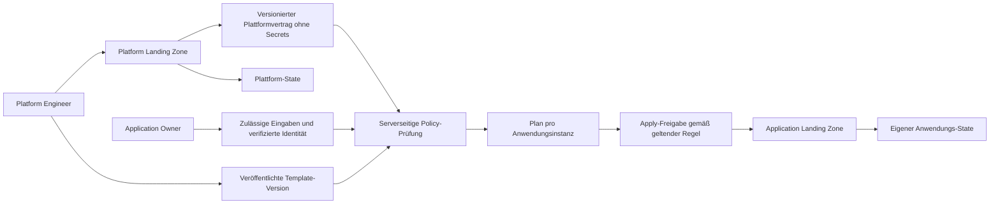

# Platform Landing Zone und Application Landing Zones

Stand: 2026-10-01. **Architektur in Abstimmung, noch nicht implementiert.** Unveränderliche veröffentlichte Template-Versionen und ausdrücklich angeforderte Upgrades wurden vom Benutzer bestätigt. Der Platform Engineer soll je Template direkte oder genehmigungspflichtige Bereitstellung einstellen können; bis zur Implementierung bleibt die bestehende Freigabepflicht wirksam.

Dieser Entwurf erweitert [Planung](planning.md), [gemeinsames Feature-Modell](common-feature-model.md) und [Editor-Designprinzipien](editor-design-principles.md). Er ersetzt keine bestehenden Konfigurationen, State-Adressen oder Berechtigungen. Kunden-Apply bleibt bis zu einer ausdrücklichen Freigabe gesperrt. Die laufende Arbeit an Regions-/SNA-Ansicht und VPN bleibt unabhängig davon nutzbar.

## Ziel und Abgrenzung

Eine Platform Landing Zone stellt Governance, freigegebene Ordner, Connectivity einschließlich STACKIT Network Areas (SNAs), zentrale Plattformdienste und deren Infrastrukturprojekte bereit. Anwendungsprojekte gehören künftig zu eigenständigen Application Landing Zones. Ein Application Owner bestellt eine Instanz aus einem veröffentlichten Projekt-Template; er bearbeitet nicht die organisationsweite Plattformkonfiguration.

Der aktuelle Accelerator verbindet diese Lebenszyklen im Root `src/main.tf`: zentrale Module und Anwendungsprojekte (`landing_zones`, Sandboxes, Namespace-Dienste) teilen Konfiguration und Ausführung. Zwei Ansichten allein reichen deshalb nicht. Benötigt werden getrennte Accelerator-Einstiegspunkte, ein freigegebener Plattformvertrag und unabhängig verwaltete Anwendungsinstanzen.

## Rollen und Benutzerverwaltung

Zwei fachliche Rollen gelten **pro Tenant**, nicht global. Ein Benutzer kann beide Rollen haben und in verschiedenen Kundenorganisationen unterschiedlich berechtigt sein. Anmeldung, Configurator-Mitgliedschaft, STACKIT-Rechte und GitHub-Zugriff bleiben getrennte Nachweise.

| Fähigkeit | Platform Engineer | Application Owner |
|---|---|---|
| Plattform konfigurieren und deren Plan anfordern | Ja, im eigenen Tenant | Nein |
| Projekt-Templates erstellen, prüfen, versionieren und veröffentlichen | Ja | Nein |
| Veröffentlichte, für ihn zugelassene Templates sehen | Ja | Ja |
| Eigene Anwendungsinstanz bestellen und deren Plan sehen | Ja | Ja |
| Instanzen anderer Benutzer sehen/verändern | Nur nach Tenant-Policy | Nur durch explizite Teamfreigabe |
| Plattform-Credentials lesen oder herunterladen | Nein; nur autorisierte Nutzung | Nein |
| Kunden-Apply | Zusätzliche Run-Freigabe/Policy | Zusätzliche Run-Freigabe/Policy |
| Tenant-Mitglieder/Rollen verwalten | Separat delegierte Verwaltungsfähigkeit | Nein |

Die vorgeschlagenen bisherigen Rollen Viewer/Editor/Deployer/Tenant-Admin aus dem Hauptplan werden für dieses Zielbild nicht zusätzlich als vier sichtbare Produktrollen eingeführt. Feinere technische Fähigkeiten (Mitgliederverwaltung, Credential-Delegation, Apply-Freigabe) bleiben explizite Grants. Ein Platform Engineer erhält nicht automatisch alle Verwaltungsrechte. Mitgliederverwaltung wird als tenantgebundene Fähigkeit innerhalb der Platform-Engineer-Rolle delegiert, nicht als dritte fachliche Persona. Rollen-/Einladungsänderungen benötigen erneute serverseitige Prüfung und Audit-Eintrag; niemand darf sich selbst weitergehende Rechte erteilen.

Die Umstellung von bisherigen Viewer-/Editor-/Deployer-/Admin-Modellen erfolgt schrittweise nach Inventarisierung der tatsächlich gespeicherten Mitgliedschaften. Es gibt keine pauschale Zuordnung „Editor wird Platform Engineer“ und keine automatische Rechteerweiterung. Neue Rollen werden ausdrücklich durch berechtigte Tenant-Verantwortliche bestätigt; bis dahin bleiben vorhandene Zugriffe unter ihrem bisherigen, höchstens gleichwertigen Umfang. Migrationstests müssen auch kombinierte Rollen, Widerruf und offene Jobs abdecken.

PostgreSQL speichert externe Identitätsverknüpfungen, Tenant-Mitgliedschaften, Rollen, Einladungen und Audit-Ereignisse. Keine eigene Passwortverwaltung. Jede API, Queue-Nachricht, Artefaktabfrage und Secret-Nutzung prüft den Tenant und die Objektberechtigung serverseitig. Ein Rollenwechsel im Browser ist kein Sicherheitsmechanismus.

## Identität, STACKIT-Onboarding und Bootstrap

**Verifiziert:** STACKIT verwendet rollenbasierte, additive Berechtigungen. Rollen auf Organisationen und Ordnern werden vererbt; eine schwächere Projektrolle hebt diese Rechte nicht auf. Ein Configurator-Login allein gewährt keine STACKIT-API-Berechtigung. [STACKIT Rollenmodell](https://docs.stackit.cloud/platform/access-and-identity/roles-permissions/roles-permissions/)

**Verifiziert:** Vor einer weiteren Rollenzuweisung muss der Benutzer laut Resource-Manager-Dokumentation bereits eine der genannten Organisationsrollen besitzen. STACKIT empfiehlt dafür `organization.viewer`; diese gewährt minimale Organisationssicht ohne geerbten Zugriff auf Ordner und Projekte. Daher nicht vorsorglich Reader oder Owner auf einen gesamten Anwendungsordner vergeben. Den vollständigen Onboarding- und Portalablauf mit realem Testbenutzer prüfen. [Resource Manager Access Control](https://docs.stackit.cloud/platform/resource-manager/basics/access-control/)

**Noch offen:** Ein freigegebener STACKIT-IdP-Client für unsere eigene App einschließlich Discovery, Clientregistrierung, Claims, Logout und API-Delegation. Die öffentliche OIDC-Anleitung beschreibt einen externen IdP, dem STACKIT vertraut; sie belegt keinen beliebig registrierbaren Configurator-Client beim STACKIT-IdP. [STACKIT IdP](https://docs.stackit.cloud/platform/access-and-identity/stackit-idp/getting-started/), [OIDC-Federation](https://docs.stackit.cloud/platform/access-and-identity/stackit-idp/how-tos/generic-oidc-1_0-federation-guide/)

Vorgeschlagener Ablauf:

1. Benutzer authentifiziert sich über einen freigegebenen IdP; bis zur Klärung bleibt GitHub als bestehender Login erhalten.
2. STACKIT-Benutzerkonto und konkrete Organisation werden gesondert verifiziert. Keine automatische Verknüpfung allein anhand übereinstimmender E-Mail-Adressen; stabile Issuer-/Subject-Kennung speichern.
3. Ein berechtigter Organisationsadministrator bestätigt Tenant-Zuordnung und erste Platform-Engineer-Mitgliedschaft. Besitz eines Service-Account-Schlüssels beweist keine persönliche Organisationsmitgliedschaft.
4. Fehlende Organisationsmitgliedschaft des Application Owners wird als expliziter Onboarding-Schritt behandelt. Er erhält nur die für das Onboarding nötige Rolle und später die freigegebene Projektrolle.
5. Für Bootstrap werden temporär autorisierte Berechtigungen benötigt, um Projekt, initialen Service Account und Backend anzulegen. Eine Anmeldung allein erzeugt diese Rechte nicht. Unterstützte Benutzer-API-Delegation erst nachweisen; andernfalls bleibt ein dokumentierter einmaliger Administrator-/Service-Account-Bootstrap nötig.
6. Nach Bootstrap temporäre Berechtigungen entfernen und Plattform-/Anwendungs-Provisionierung mit getrennten, eingeschränkten Ausführungsidentitäten betreiben.

Die konkrete Permission-Matrix für Projektanlage, Rollenzuweisung, Netzwerkzuordnung und Dienstanlage ist per API/Provider-Spike nachzuweisen. Keine pauschale Zusage, dass `organization.viewer` für Provisionierung reicht: Diese Rolle betrifft die Benutzeraufnahme, nicht die Provisionierungsidentität.

## Projekt-Templates und Instanzen

**Entschieden:** Veröffentlichte Template-Versionen bleiben unveränderlich. Bestehende Instanzen erhalten neue Versionen nur durch ein ausdrücklich angefordertes Upgrade mit eigenem Plan.

Ein veröffentlichtes `ApplicationTemplateVersion` enthält:

- Tenant, stabile Template-ID, Version, Status (`draft`, `published`, `retired`), Autor und Freigabe.
- Gepinnte Accelerator-Version, Compiler-/Schemasversion und Kompatibilität zum Plattformvertrag.
- Anwendungsprofil, etwa VM-Projekt, eigenes Kubernetes-Projekt oder Namespace auf einem zentralen Kubernetes-Cluster. Diese drei Varianten sind fachlich verschieden; ein Namespace ist kein eigenständiger Cluster.
- Feste Vorgaben: erlaubte Zielordner, Regionen und SNAs, Public-/Corporate-Typ, verpflichtende Dienste, Rollen, Namensregeln und Quoten.
- Explizit freigegebene Eingaben mit Typ, Auswahlwerten, Erklärung und Default, beispielsweise Name, Umgebung und zulässige Größenklasse.
- Deklarative Dienstkonfiguration, etwa STACKIT Secrets Manager und STACKIT Observability, sowie sichere Credential-Referenzen. Keine Secretwerte oder beliebigen Terraform-Skripte.
- Dokumentierte Ergebnisse, Voraussetzungen, technische Grenzen und Zuständigkeit für Betrieb/Löschung.

Eine `ApplicationInstance` bindet eine konkrete Template-Version, zulässige Benutzereingaben, verifizierten Antragsteller/Projektverantwortlichen, Plattformvertragsversion, State-Identität und Ausführungsrevision. Templates werden kopiert/instanziiert, spätere Änderungen aktualisieren bestehende Instanzen nicht automatisch. Updates sind eigene Pläne mit sichtbarem Diff und Freigabe.

Der Server setzt Organisation, Ordner, zulässige Region/SNA und Verantwortlichen aus verifizierten Bindungen. Er übernimmt diese Werte nicht ungeprüft aus Formular, Chat oder API. Der STACKIT-Projektverantwortliche muss ein geeignetes menschliches Konto sein; die Produktrolle Application Owner bedeutet nicht automatisch unbegrenzte STACKIT-IAM-Owner-Rechte. Welche konkrete Projektrolle/Owner-Zuweisung fachlich nötig ist, wird je Template festgelegt und mit der API getestet.

**Wichtige offene Grenze:** Das bestehende Anwendungsprojektmodul ist kein vollständiger VM-/Kubernetes-Workload-Katalog. Vor Benennung eines Templates als „VM“ oder „Kubernetes“ muss klar sein, ob nur Projekt und Basisdienste oder tatsächlich VMs/Cluster/Namespaces erstellt werden. Nicht vorhandene Accelerator-Funktionen sind eigene Erweiterungen.

## Accelerator-Vertrag, State und Ausführung

Vorgeschlagene neue Roots (konkrete Pfade noch zu entscheiden): `platform` für zentrale Ressourcen und `application` für genau eine Anwendungsinstanz. Bestehendes `src` bleibt während der Migration kompatibel. Wiederverwendbare Module werden geteilt; kein Kopieren kompletter Plattformkonfigurationen pro Bestellung.

Die Plattform veröffentlicht einen **nicht sensitiven, versionierten Vertrag**: Organisations-ID, freigegebene Ordner-IDs, Regionen, SNA-/Netzwerkreferenzen, erlaubte zentrale Cluster-/Dienstreferenzen, Fähigkeiten und Policy-Version. Anwendungen konsumieren nur diesen Vertrag, nicht den vollständigen Plattform-State. Server und Runner prüfen Freigabe, Aktualität und Zielorganisation vor jedem Plan und Apply. Es gibt keinen direkten `terraform_remote_state`-Zugriff der Anwendungsinstanzen auf den Plattform-State und keine Weitergabe seiner Backend-Credentials.

Getrennte Backend-Keys und Berechtigungen für Bootstrap, Plattform und jede Anwendungsinstanz; Tenant-Trennung bleibt erforderlich. Der vorhandene Accelerator-Bootstrap bleibt Grundlage der Backend-Bereitstellung. Keine Umstellung auf einen neuen zentralen Kunden-State ohne gesonderte Entscheidung. State-Locks und Queue-Locks pro Instanz verhindern konkurrierende Mutationen; geteilte Quoten/Netzwerkänderungen brauchen zusätzliche tenantweite Koordination.

Eine zentrale Plattformressource hat genau einen State-Eigentümer. Anwendungs-States dürfen sie referenzieren, aber nicht erneut verwalten. Entfernen einer SNA/eines Clusters wird blockiert, solange Anwendungsinstanzen davon abhängen. Laufende Ausführungen müssen vor Vertragsänderungen berücksichtigt werden.

Anwendungsjobs bekommen eine eingeschränkte, tenantgebundene Ausführungsidentität und ausschließlich freigegebene Ressourcenreferenzen. Die Template-Instanziierung ist kein Weg, den organisationsweiten Bootstrap-Service-Account zu delegieren. Retry/Idempotenz über Instanz-ID und Bestellschlüssel, kein zweites Projekt bei erneutem Klick. Quoten werden atomar reserviert und nach Fehlern abgeglichen.

Ein Klick auf „Bereitstellen“ startet zunächst Validierung und Plan. Automatischer Apply ist eine spätere explizite Produkt-/Tenant-Policy; die derzeitige persönliche Freigabepflicht für Kunden-Apply gilt unverändert. **Bestätigte Entscheidung:** Der Platform Engineer kann je Template sowohl direkte Bereitstellung als auch einen Genehmigungsablauf erlauben. Diese Policy wird serverseitig vor Plan und Apply geprüft; eine Änderung hebt die heutige Kunden-Apply-Freigabepflicht nicht vorzeitig auf. Der sichere Initialwert für neue Templates (Genehmigung erforderlich) ist ein Umsetzungsvorschlag.

## GitHub und Application-Owner-Erlebnis

Der Application Owner sollte keinen Fork auswählen müssen, nur um ein freigegebenes Template zu bestellen. Veröffentlichung kann durch den Platform Engineer aus seiner benutzergebundenen GitHub-Verbindung einen signierten/gehashten, unveränderlichen Snapshot in den Tenant-Katalog übernehmen. Lesen dieses veröffentlichten Snapshots ist kein Repositoryzugriff unter fremden Credentials.

Offen bleibt, wie Instanzen im Git archiviert werden: persönliche GitHub-Verbindung des Application Owners oder vom Platform Engineer ausdrücklich ausgeführter Export/Review. Bis zur Entscheidung PostgreSQL plus unveränderliche Konfigurationsartefakte als vorgeschlagener Instanznachweis. Kein stiller Wechsel auf zentrale GitHub-Tokens und keine Hintergrundschreibzugriffe unter dem Token eines anderen Benutzers. Die ursprüngliche Vorgabe benutzergebundener Repositoryzugriffe bleibt erhalten.

## UI-Auswirkungen

Platform Engineer: Plattform, Projekt-Templates, Veröffentlichungen, Anwendungsübersicht und getrennt berechtigte Tenant-Verwaltung. Application Owner: freigegebene Projekt-Templates, eigene/zugewiesene Anwendungen, Status, Pläne und Zugänge. Aktueller Tenant und aktuelle Rolle sind stets sichtbar.

Die aktuelle Komponentenansicht bleibt Grundlage des Plattformeditors. Der spätere Template-Editor nutzt dieselben Fachkomponenten, ergänzt jedoch „fest vorgeben“, „Application Owner auswählen lassen“ und „nicht verfügbar“. Ein unbekanntes Feld ist nicht automatisch eine freigegebene Variable. Der Chat verwendet dieselben Autorisierungs- und Templateschemas wie das Formular.

## Migration ohne Ressourcenverlust

- Bestehende Gesamtkonfigurationen, Hashes und State-Adressen bleiben unverändert lesbar.
- Zunächst neue reine Plattformen und neue Anwendungsinstanzen unterstützen.
- Bestehende Projekte und ihre gemeinsam verwalteten Ressourcen inventarisieren; eindeutigen zukünftigen State-Eigentümer festlegen.
- Separaten, getesteten Migrationslauf mit Backup, Locks, Import-/State-Move-Plan, Abbruch- und Rückkehrstrategie entwickeln. Cross-State-Migration ist kein gewöhnlicher UI-Speichervorgang.
- Vor und nach jeder Migration nachweisen, dass weder unerwartete Neuanlage noch Löschung geplant wird. Keine automatische Migration durch Login, Template-Auswahl oder Öffnen eines Dokuments.
- Bekannte Grenzen #22 (Folder-Destroy), #37 (privates Kubernetes), #65 (Firewall), #80 (regionale Namespace-Verkabelung) gelten auch für die neuen Roots.

## Diskussionsentscheidungen und Umsetzung

Empfehlungen für die nächste gemeinsame Entscheidung:

1. Zwei Rollen pro Tenant; beide gleichzeitig möglich. Mitgliedschaftsverwaltung separat delegieren.
2. Application Owner benötigt zunächst ein bereits verifiziertes STACKIT-Konto; geführte Organisationsaufnahme, keine implizite Kontoerstellung.
3. Zuerst ein Template „Anwendungsprojekt mit Basisdiensten“, danach eigene Cluster/VMs und zentrale Namespace-Angebote jeweils nach nachgewiesenem Accelerator-Support.
4. Template-Veröffentlichung als unveränderlicher Tenant-Katalog-Snapshot; Git-Ablage der Instanzen gesondert entscheiden.
5. Erst Plattform- und Anwendungs-Plan getrennt implementieren, dann kontrollierter Apply; Bestandsmigration zuletzt.

### Phase A – Verträge und IAM-Nachweis

- [x] Zielbild, Rollentrennung und offene Annahmen dokumentieren.
- [x] Unveränderliche veröffentlichte Template-Versionen und explizite Upgrades vom Benutzer bestätigt.
- [x] Zukünftige Apply-Policy durch Platform Engineer je Template einstellbar: direkt oder genehmigungspflichtig.
- [ ] Entscheidungen zu Verantwortlichem/Team, Git-Ablage und Freigabeweg treffen.
- [ ] STACKIT-IdP-Client und delegierte Benutzer-API-Berechtigungen mit STACKIT klären.
- [ ] Organisationsaufnahme und minimale Rechte mit eigenem Testbenutzer nachweisen.
- [ ] Inventar bestehender Plattform-/Anwendungsressourcen und Capability-Matrix erstellen.
- [ ] Plattformvertrag, Template-Schema und getrennte State-Eigentümerschaft reviewen.

### Phase B – Accelerator und reine Plan-Unterstützung

- [ ] Neue Roots/Module und versionierten Plattformvertrag implementieren.
- [ ] Template-Compiler mit erlaubten Eingaben und festen Policies implementieren.
- [ ] Isolierte Anwendungs-States und eingeschränkte Runner-Credentials anbinden.
- [ ] Native OpenTofu-Vertragstests und Plan-Negativtests für fremde Ordner/SNAs/Organisationen.
- [ ] Separates Konzept für Bestandsmigration ausarbeiten; noch nicht ausführen.

### Phase C – Configurator Self-Service

- [ ] Tenant-Rollen, Einladungen, Identitätsverknüpfung und Audit-Log implementieren.
- [ ] Template-Entwurf, Veröffentlichung, Katalog und Stilllegung implementieren.
- [ ] Rollenabhängige Ansichten, Bestellformular und eigene Instanzen implementieren.
- [ ] API-/RLS-/Job-Negativtests gegen tenantfremde Zugriffe und Rolleneskalation.
- [ ] Idempotenz, Quoten, Fehlerwiederaufnahme und Template-Updates testen.
- [ ] Kunden-Apply erst nach konkreter Freigabe; bestätigte spätere Self-Service-Apply-Policy sicher implementieren.

## Erster technischer Prototyp (2026-10-01, noch nicht an API/Runner angebunden)

- `src/application` ist ein separater Root für genau eine neue Anwendungsinstanz,
  mit Verweis auf freigegebene Plattformressourcen und eigenem S3-Backend-Key.
- `app/packages/domain/src/application-plan.ts` enthält einen reinen Compiler für
  veröffentlichte Templates, verifizierten Serverkontext und streng begrenzte
  Bestelleingaben. Tenant-, Organisations-, Revisions- und Zielbindung werden geprüft.
- Der Compiler übernimmt den Owner aus dem Serverkontext und Dienste aus dem
  Template. Er ersetzt weder serverseitige Mitgliedschaftsprüfung noch tatsächliche
  STACKIT-Identitätsprüfung, Veröffentlichung/Persistierung oder Job-Autorisierung.
- Vier native Mock-Plan-Tests prüfen Public/Corporate sowie Tenant-/Revisionsgrenzen;
  vier Compiler-Tests prüfen isolierte State-Schlüssel, Bindungen und Eingabe-Injektion.
- Ausführung bleibt ausdrücklich deaktiviert; `direct` ist nur gespeicherte
  zukünftige Policy. Kein API-Endpunkt, keine Rollenumschaltung und kein Kunden-Plan
  wurden damit bereits freigeschaltet.

Das geteilte Modul erzeugt außer den auswählbaren Diensten auch einen Automations-
Service-Account samt Schlüssel und Object-Storage-Buckets/Credentials. Dieser Umfang
muss beim Veröffentlichen des Basis-Templates und im Plan sichtbar sein. Die
Anwendungsinstanz verwendet für ihren ersten Lauf das vorhandene Bootstrap-Backend,
nicht ihren erst später erzeugten eigenen Bucket.
